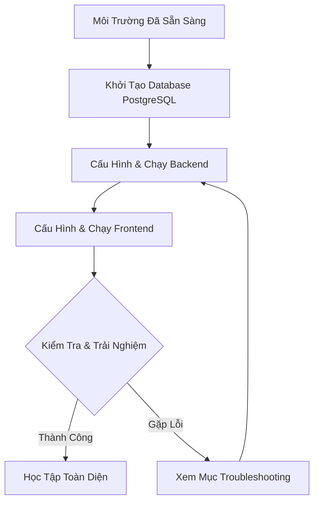

# 📖 HƯỚNG DẪN CÀI ĐẶT VÀ VẬN HÀNH (RUN MANUAL)
### 🎯 LangWhich - Hệ Thống Học TOEIC Toàn Diện (Full-Stack)

Chào mừng bạn đến với tài liệu hướng dẫn vận hành của **LangWhich**. Hệ thống được xây dựng trên mô hình Client-Server hiện đại: **Next.js (App Router) + TailwindCSS** cho Frontend, **Spring Boot (Java)** cho Backend và **PostgreSQL** làm cơ sở dữ liệu.

Tài liệu này sẽ hướng dẫn bạn chi tiết từng bước từ cài đặt môi trường đến khởi chạy toàn bộ hệ thống trên máy tính cá nhân (Local Development).

---

## 🗺️ Quy Trình Khởi Chạy Hệ Thống



---

## 💻 1. Yêu Cầu Hệ Thống & Công Cụ (Prerequisites)

Trước khi bắt đầu, hãy đảm bảo máy tính của bạn đã cài đặt sẵn các công cụ sau:

| Công cụ | Phiên bản khuyến nghị | Mục đích sử dụng | Lệnh kiểm tra cài đặt |
| :--- | :--- | :--- | :--- |
| **Java JDK** | JDK 17 hoặc 21 (LTS) | Biên dịch & Chạy mã nguồn Backend | `java -version` |
| **Node.js** | Node.js v18.x trở lên (khuyên dùng v20 LTS) | Cài đặt thư viện & Chạy Frontend Next.js | `node -v` |
| **npm** / **yarn** | npm v9.x+ hoặc Yarn v1.22+ | Trình quản lý package của JavaScript | `npm -v` |
| **Maven** | Maven 3.8+ (tùy chọn, đã tích hợp sẵn wrapper) | Biên dịch & Quản lý package Java | `mvn -v` |
| **PostgreSQL** | PostgreSQL 14 hoặc mới hơn | Cơ sở dữ liệu chính của hệ thống | (Kiểm tra qua pgAdmin hoặc DBeaver) |

---

## 🗄️ 2. Khởi Tạo Cơ Sở Dữ Liệu (PostgreSQL) & Flyway Migration

Hệ thống sử dụng PostgreSQL kết hợp cùng công cụ **Flyway** để tự động khởi tạo, cập nhật cơ sở dữ liệu khi khởi động Backend. Bạn không cần phải chạy bất kỳ file SQL tạo bảng thủ công nào!

1. **Mở công cụ quản lý cơ sở dữ liệu** của bạn (ví dụ: `pgAdmin`, `DBeaver` hoặc terminal CLI `psql`).
2. **Kết nối đến server PostgreSQL local** của bạn.
3. **Tạo một Database mới** với tên là **`langwhich_db`**:
   ```sql
   CREATE DATABASE langwhich_db;
   ```
4. Đảm bảo port mặc định là `5432` và bạn ghi nhớ **username** cùng **password** tài khoản PostgreSQL của mình để cấu hình tiếp ở bước sau.
5. Khi bạn chạy Backend Spring Boot ở bước 3, **Flyway** sẽ tự động quét thư mục `db/migration` và khởi tạo toàn bộ cấu trúc bảng cùng các index tối ưu hiệu năng.

---

## ☕ 3. Cấu Hình & Khởi Chạy Backend (Spring Boot)

Mã nguồn Backend nằm ở thư mục `/backend`.

### Bước 3.1: Tạo File Môi Trường `.env`
1. Di chuyển vào thư mục `backend/`.
2. Nhân bản file `.env.example` thành file `.env`:
   ```bash
   cp .env.example .env
   ```
3. Mở file `.env` vừa tạo và chỉnh sửa các thông số kết nối cơ sở dữ liệu cho đúng với cấu hình máy của bạn:

```env
# URL kết nối PostgreSQL (đổi localhost/port nếu cần thiết)
DB_URL=jdbc:postgresql://localhost:5432/langwhich_db

# Thông tin tài khoản PostgreSQL của bạn
DB_USERNAME=postgres
DB_PASSWORD=your_secure_password  # Điền mật khẩu PostgreSQL của bạn ở đây

# JWT Secret Key (Khóa bảo mật token - Phải có độ dài tối thiểu 256-bit khi giải mã)
JWT_SECRET=c2VjcmV0LWtleS1mb3ItbGFuZ3doaWNoLXRvZWljLXBsYXRmb3JtLW11c3QtYmUtbG9uZy1lbm91Z2g=
JWT_ACCESS_EXPIRATION=900000       # 15 phút (ms)
JWT_REFRESH_EXPIRATION=604800000  # 7 ngày (ms)

# Server Configuration
SERVER_PORT=8080

# Cấu hình Hibernate (Sử dụng validate khi đã có Flyway quản lý schema)
JPA_DDL_AUTO=validate
JPA_SHOW_SQL=false
```

> [!WARNING]
> Mật khẩu PostgreSQL của bạn tuyệt đối không nên bỏ trống nếu bạn cài đặt PostgreSQL bảo mật. Hãy đảm bảo chỉnh sửa `DB_PASSWORD` chính xác, nếu không backend sẽ bị lỗi kết nối ngay khi khởi chạy.

### Bước 3.2: Khởi Chạy Backend
Bạn có thể khởi chạy backend bằng một trong hai cách dưới đây:

#### Cách A: Chạy bằng Dòng Lệnh (Terminal/Console)
Mở một cửa sổ Terminal mới tại thư mục gốc dự án và chạy các lệnh sau:
```powershell
# Chuyển vào thư mục backend
cd backend

# Chạy ứng dụng bằng Gradle (Windows)
.\gradlew bootRun

# Chạy ứng dụng bằng Gradle (Linux/macOS)
./gradlew bootRun
```

#### Cách B: Chạy trực tiếp từ IDE (Khuyên dùng khi Dev)
1. Mở IDE của bạn (IntelliJ IDEA, Eclipse hoặc VS Code).
2. **Import** thư mục `backend` như một dự án **Gradle** (chọn file `build.gradle`).
3. Để IDE tự động tải xuống các dependencies trong `build.gradle`.
4. Tìm đến file chính: `src/main/java/com/langwhich/LangwhichBackendApplication.java`.
5. Click chuột phải chọn **Run 'LangwhichBackendApplication'** hoặc nhấn nút **Debug** để chạy ứng dụng.

### Bước 3.3: Xác Nhận Backend Hoạt Động
Khi thấy dòng log cuối cùng dạng:
`Started LangwhichBackendApplication in X.XXX seconds (process running for Y.YYY)`
Backend đã chạy thành công tại cổng **`http://localhost:8080`**.

Bạn có thể kiểm tra sức khỏe của API qua trình duyệt:
* Truy cập thử: `http://localhost:8080/actuator/health` (nếu đã bật Spring Actuator).
* Hoặc kiểm tra console xem có bất kỳ dòng báo lỗi đỏ nào liên quan đến Database Connection hay không.

---

## ⚡ 4. Cấu Hình & Khởi Chạy Frontend (Next.js)

Mã nguồn Frontend nằm ở thư mục `/frontend`.

### Bước 4.1: Tạo File Môi Trường `.env.local`
1. Di chuyển vào thư mục `frontend/`.
2. Nhân bản file `.env.local.example` thành file `.env.local`:
   ```bash
   cp .env.local.example .env.local
   ```
3. Mở file `.env.local` và kiểm tra cấu hình URL trỏ đến backend API:
   ```env
   NEXT_PUBLIC_API_URL=http://localhost:8080
   ```

### Bước 4.2: Cài Đặt Các Dependencies
Mở một cửa sổ Terminal mới (không tắt terminal của backend) và chạy:
```powershell
# Chuyển đến thư mục frontend
cd frontend

# Cài đặt toàn bộ thư viện cần thiết
npm install
```

> [!NOTE]
> Quá trình cài đặt thư viện (`node_modules`) có thể mất từ 1-2 phút tùy thuộc vào tốc độ internet của bạn. Nếu gặp xung đột dependency, bạn có thể chạy `npm install --legacy-peer-deps`.

### Bước 4.3: Khởi Chạy Dự Án Next.js ở Môi Trường Phát Triển
Sau khi cài đặt xong thư viện, khởi chạy server frontend bằng lệnh:
```bash
npm run dev
```

### Bước 4.4: Truy Cập Trải Nghiệm 🚀
Mở trình duyệt web của bạn và truy cập đường dẫn:
```txt
http://localhost:3000
```
Bây giờ, bạn đã có thể bắt đầu sử dụng giao diện hiện đại, đăng ký tài khoản, đăng nhập và bắt đầu học tập ngữ pháp cũng như từ vựng TOEIC trên LangWhich!

---

## 🛠️ 5. Bảng Tra Cứu Lệnh Nhanh (Command Cheat-sheet)

| Thư mục | Tác vụ | Lệnh thực thi |
| :--- | :--- | :--- |
| **Root** | Di chuyển vào Backend | `cd backend` |
| **Root** | Di chuyển vào Frontend | `cd frontend` |
| **Backend** | Clean và Compile dự án | `.\gradlew clean compileJava` |
| **Backend** | Đóng gói sản phẩm thành file JAR | `.\gradlew bootJar` |
| **Backend** | Chạy Server Development | `.\gradlew bootRun` |
| **Frontend** | Cài đặt các package | `npm install` |
| **Frontend** | Chạy Server Development | `npm run dev` |
| **Frontend** | Build phiên bản Production | `npm run build` |
| **Frontend** | Chạy bản đã build Production | `npm start` |
| **Frontend** | Kiểm tra lỗi TypeScript / Lint | `npm run typecheck` hoặc `npm run lint` |

---

## 🚨 6. Hướng Dẫn Sửa Lỗi Thường Gặp (Troubleshooting)

### 📌 1. Lỗi Cổng Cổng `8080` Hoặc `3000` Đã Bị Sử Dụng (Port Already In Use)
* **Triệu chứng:** Backend hoặc Frontend không thể khởi động, báo lỗi `Address already in use` hoặc `Port 8080 was already in use`.
* **Cách khắc phục:**
  * **Cách A (Tắt ứng dụng đang chiếm dụng):**
    * *Windows (PowerShell):* Tìm PID của cổng đang chạy bằng cách gõ `netstat -ano | findstr 8080`. Sau đó tắt process đó bằng: `taskkill /F /PID <Số_PID>`.
  * **Cách B (Đổi cổng khác):**
    * *Với Backend:* Mở file `backend/.env`, đổi cổng ở dòng `SERVER_PORT=8082`.
    * *Với Frontend:* Chạy bằng lệnh `npm run dev -- -p 3001` để ép Next.js chạy ở cổng `3001`. Đồng thời cập nhật lại cors/api url tương ứng.

### 📌 2. Lỗi Kết Nối PostgreSQL (Database Connection Refused)
* **Triệu chứng:** Dòng lỗi đỏ dài xuất hiện trên Terminal Backend: `Connection to localhost:5432 refused` hoặc `FATAL: password authentication failed for user "postgres"`.
* **Cách khắc phục:**
  1. Kiểm tra xem service PostgreSQL đã được start trong máy tính chưa (Gõ `services.msc` trên Windows, tìm PostgreSQL và click Start/Restart).
  2. Kiểm tra xem bạn đã tạo database tên là `langwhich_db` hay chưa.
  3. Mở file `backend/.env` và đối chiếu lại chính xác thông tin `DB_USERNAME` và `DB_PASSWORD`.

### 📌 3. Lỗi Khóa Bí Mật JWT (JWT Weak Key Exception)
* **Triệu chứng:** Backend báo lỗi `WeakKeyException` khi chạy hoặc khi tạo Token JWT.
* **Nguyên nhân:** Khóa `JWT_SECRET` trong môi trường quá ngắn hoặc không đảm bảo độ an toàn tối thiểu (ít nhất 256-bit / 32 bytes khi đã giải mã).
* **Cách khắc phục:** Hãy sử dụng key mặc định dài được cung cấp trong file mẫu `.env.example`, hoặc tự generate một chuỗi ký tự Base64 dài ngẫu nhiên bằng lệnh:
  * *Trong terminal:* `openssl rand -base64 32` rồi paste chuỗi thu được vào biến `JWT_SECRET` ở cả `.env`.

### 📌 4. Lỗi CORS (Cross-Origin Resource Sharing) ở Frontend
* **Triệu chứng:** Giao diện Frontend tải được nhưng khi nhấn đăng nhập/đăng ký thì console báo lỗi màu đỏ dạng: `Access to XMLHttpRequest at '...' from origin 'http://localhost:3000' has been blocked by CORS policy`.
* **Cách khắc phục:**
  * Mở `backend/.env` và đảm bảo biến `CORS_ALLOWED_ORIGINS` đã chứa chính xác URL của Frontend: `http://localhost:3000`.
  * Khởi động lại Server Backend để cấu hình Cors mới được áp dụng.

### 📌 5. Lỗi Thiếu File `.env` hoặc `.env.local`
* **Triệu chứng:** 
  * Backend báo lỗi thiếu các biến môi trường kết nối database.
  * Frontend gọi API lỗi hoặc báo không tìm thấy URL API.
* **Cách khắc phục:** Đảm bảo bạn đã đổi tên các file ví dụ (đã xóa đuôi `.example`):
  * Cần có `backend/.env` (chứ không phải `backend/.env.example`)
  * Cần có `frontend/.env.local` (chứ không phải `frontend/.env.local.example`)

---

> [!TIP]
> **Mẹo phát triển:** Trong quá trình phát triển (Development), bạn nên mở cả 2 Terminal song song để tiện theo dõi log. Nếu có bất kỳ chỉnh sửa nào ở backend Java, tính năng Hot-Reload của các IDE hiện đại hoặc chế độ auto-compile của Maven sẽ giúp bạn kiểm tra thay đổi nhanh chóng mà không cần restart thủ công toàn bộ server.

---

Chúc bạn có những trải nghiệm học tập và phát triển ứng dụng **LangWhich** thật thú vị và năng suất! Nếu có bất kỳ câu hỏi nào khác trong quá trình vận hành, vui lòng liên hệ với nhóm hỗ trợ kỹ thuật hoặc người hướng dẫn dự án của bạn. 🎯
