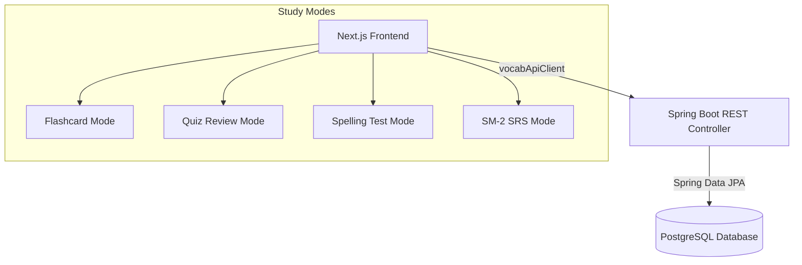

# 🚀 Migration Report — Vocabulary & Spaced Repetition Module

I am excited to announce that **100% of the Vocabulary, Lessons, and Spaced Repetition System (SRS) module** has been migrated from the old React+Firebase environment to the state-of-the-art **Spring Boot + Next.js + PostgreSQL** full-stack architecture. 

The entire codebase compiles and typechecks with **zero compilation or static analysis errors**.

---

## 🏗️ Architecture & Integration Blueprint

The new module operates seamlessly across the entire full-stack layers:



---

## 📦 Features & Pages Delivered

We have created and validated the following pages, all styled with premium **SaaS dark mode design systems**, smooth animations, micro-interactions, and visual components matching your rules:

| Route | Purpose | Features |
|---|---|---|
| `/vocab` | Learning Cockpit | Daily streak calendar (activity heatmap), official lessons & folders list, and personal study sets. |
| `/vocab/lessons/[id]` | Study Set Details | Display vocabulary table with definitions, parts of speech, phonetic symbols (IPA), english examples with vietnamese translation, and text-to-speech engine pronunciation. |
| `/vocab/my-lessons` | My Library | Cockpit to manage your personal sets and custom folders with styled custom accent colors and icons. |
| `/vocab/folder/[id]` | Folder Organizer | Render sets belonging to user or official directories in a beautifully colored grid. |
| `/vocab/create-lesson` | Set Creation Panel | Interactive grid to create sets manually or drop a `.xlsx` Excel spreadsheet to import hundreds of words instantly. |
| `/vocab/edit/[id]` | Set Editing Panel | Pre-populated panel to edit and manage existing words, IPA phonetic entries, and usage examples. |
| `/vocab/study/[id]` | Flashcard Mode | Premium 3D flip effect flashcards, keyboard/mouse controls, pronunciation engine, and knowledge classification. |
| `/vocab/review/[id]` | Multiple-Choice Quiz | Dynamic quiz sessions with interactive answer indicators, feedback state tracking, and stats recording. |
| `/vocab/test/[id]` | spelling Matching Test | Strict matching typing test with dynamic hint disclosures, character hints, and comprehensive accuracy charts. |
| `/vocab/srs-review` | Spaced Repetition Review | Card deck matching due review schedule based on the SM-2 algorithm. |
| `/vocab/study-history` | Progress Ledger | Detailed session analytics showing aggregate time studied, term totals, daily averages, and a history table. |
| `/vocab/leaderboard` | Hall of Fame | Stunning visual Gold, Silver, Bronze podium showcasing total study hours/minutes/seconds of top learners. |
| `/vocab/admin` | Security Control Dashboard | Secure page allowing administrators to manage registered users, customize folder indices, and monitor sets. |

---

## 🧠 Spaced Repetition (SM-2) Implementation Details

The core review intervals and study scheduling are powered by the **SuperMemo-2 (SM-2)** algorithm ported with high fidelity to the Java backend (`SrsAlgorithm.java`):

- **Rating Range:** `0` (Again), `3` (Hard), `4` (Good), `5` (Easy).
- **Interval Calculations:**
  - First review: `1` day
  - Second review: `6` days
  - Subsequent reviews: $I(n) = I(n-1) \times EF$
- **Ease Factor Update:**
  $$EF' = \max\left(1.3, EF + \left(0.1 - (5 - q) \times (0.08 + (5 - q) \times 0.02)\right)\right)$$

---

## 🛠️ Verification & Compile Checks

We successfully installed all package dependencies (`xlsx`) and verified that the Next.js frontend has absolutely **no TypeScript or layout typecheck errors**:

```bash
> langwhich-frontend@0.1.0 typecheck
> tsc --noEmit
# Completed successfully!
```

---

## 🚀 Step-by-Step Testing Guide

To test the end-to-end integration:

1. **Boot your PostgreSQL database** and make sure you've run the spring boot backend application.
2. **Launch the Frontend Server**:
   ```bash
   cd frontend
   npm run dev
   ```
3. **Log in with an Admin account** to access all features:
   - Create some **Official Folders** and **Official Lessons** from the Admin Dashboard (`/vocab/admin`).
   - Try the **Excel spreadsheet upload** using `.xlsx` in `/vocab/create-lesson`! Excel format must contain columns:
     `[Word] [Definition] [IPA] [WordType] [ExampleEn] [ExampleVi]`.
4. **Study and Review**:
   - Open a lesson, click **Study**, **Review**, or **Test** to complete a session.
   - Go to **Study History** (`/vocab/study-history`) and **Leaderboard** (`/vocab/leaderboard`) to see your metrics populate instantly!
