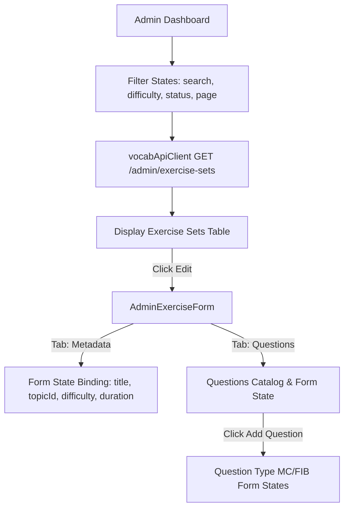

# Admin Exercise Management Architecture

This document outlines the design, data mapping, and implementation of the **Admin Exercise Management Module**, providing full-stack CRUD capabilities, status publishing, and question builder reordering for the English practice system.

---

## 1. Logic of Implementation (Logic Triển Khai)

The system isolates student-facing testing flows from administrative composition. The implementation details:

### 1.1. Exercise Set Composition
* **Metadata Persistence**: The admin creates/edits the general metadata sheet first (Title, Difficulty, Duration, category matching).
* **Topic Integration**: Links directly to the `theory_topics` table on the database to match exercises with specific grammar fields (e.g., "Subject-Verb Agreement", "Relative Clauses").
* **Question Separation**: In compliance with database constraints, the creation of question cards (Multiple Choice or Fill-in-Blank) requires an already persisted parent `ExerciseSet` ID. The CMS flows sequentially: Metadata Creation ➔ Automatic ID Persistence ➔ Question Builder Access.

### 1.2. Dynamic Question Construction
* **MULTIPLE_CHOICE Grading Strategy**: Admins formulate a text prompt and specify up to 4-5 options. Custom validation verifies that at least 2 options are entered, and exactly one is marked as `isCorrect`.
* **FILL_IN_BLANK Grading Strategy**: Admins enter a text prompt (often containing a blank placeholder) and add multiple valid text string accepted answers (fibAnswers) matching user-supplied text.
* **Explanation / Rule Binder**: Allows optional hints and grammatical explanation tags detailing *why* an option is selected.

### 1.3. Drag-and-Drop / Button Reordering
* Reordering updates the `sortOrder` integer.
* Moving cards (Up/Down) performs a swift backend `PATCH /api/admin/questions/reorder` call transmitting the full array of sequential Question IDs. The backend loops through and updates `sort_order` transactionally, avoiding client-side state draft desyncs.

---

## 2. State Management (Quản Lý Trạng Thái)

### 2.1. Client-side State Flow
The `/admin/exercises` catalog page operates dynamic states for tabular pagination, debounced text search queries, difficulty filters, and publish triggers:



### 2.2. Server-side Execution Chain
All admin endpoints undergo security authorization filtering before being executed:

```
[HTTP Client Request] 
      ➔ [Spring Security / OAuth2 Authentication] (Gated behind hasRole('ADMIN'))
      ➔ [AdminExerciseController] 
      ➔ [AdminExerciseService] 
      ➔ [ExerciseSetRepository / ExerciseQuestionRepository] 
      ➔ [PostgreSQL DB]
```

---

## 3. Frontend-Backend Integration (Tích hợp FE-BE)

| HTTP Method | API Path | Payload DTO Model | Response DTO Model | Functionality |
| :--- | :--- | :--- | :--- | :--- |
| **GET** | `/api/admin/exercise-sets` | Query parameters: `search`, `difficulty`, `isPublished`, `page`, `size` | `Page<ExerciseSetResponse>` | Query-filtered paginated list of all practice sheets. |
| **GET** | `/api/admin/exercise-sets/{id}` | None | `AdminExerciseSetDetailResponse` | Full detail retrieve including answers/explanations. |
| **POST** | `/api/admin/exercise-sets` | `AdminExerciseSetRequest` | `ExerciseSetResponse` | Creates a new practice set. |
| **PUT** | `/api/admin/exercise-sets/{id}` | `AdminExerciseSetRequest` | `ExerciseSetResponse` | Updates set metadata details. |
| **DELETE** | `/api/admin/exercise-sets/{id}` | None | HTTP 204 No Content | Cascade deletes exercise set and questions. |
| **PATCH** | `/api/admin/exercise-sets/{id}/publish` | Query parameter: `publish: boolean` | `ExerciseSetResponse` | Toggles immediate visibility to student users. |
| **POST** | `/api/admin/exercise-sets/{id}/questions` | `AdminQuestionRequest` | `AdminQuestionResponse` | Creates a single question card in a set. |
| **PUT** | `/api/admin/questions/{id}` | `AdminQuestionRequest` | `AdminQuestionResponse` | Updates question text, type, options, or answers. |
| **DELETE** | `/api/admin/questions/{id}` | None | HTTP 204 No Content | Deletes a single question card. |
| **PATCH** | `/api/admin/questions/reorder` | `AdminQuestionReorderRequest` | HTTP 200 OK | Transactionally reorders all question cards. |

---

## 4. Mermaid Sequence Diagram

The sequence diagram below displays the lifecycle of creating a dynamic question and updating its sort order inside the builder:

```mermaid
sequenceDiagram
    autonumber
    actor Admin as Admin User
    participant Page as AdminExerciseForm (FE)
    participant Ctrl as AdminExerciseController (BE)
    participant Svc as AdminExerciseService (BE)
    participant Repo as ExerciseQuestionRepository (BE)
    participant DB as PostgreSQL Database

    Admin->>Page: Type question text and specify option cards
    Admin->>Page: Click "Save Question Card"
    Page->>Ctrl: POST /api/admin/exercise-sets/{id}/questions (AdminQuestionRequest)
    Note over Ctrl: Security validation: hasRole('ADMIN')
    Ctrl->>Svc: createQuestion(setId, request)
    Note over Svc: Type-specific validation (MC has at least 1 correct; FIB has answers)
    Svc->>Repo: save(question)
    Repo->>DB: INSERT into exercise_questions & question_options
    DB-->>Repo: Saved Entities
    Repo-->>Svc: Question Entity
    Svc-->>Ctrl: AdminQuestionResponse
    Ctrl-->>Page: HTTP 201 Created (AdminQuestionResponse)
    Page-->>Admin: Show updated Questions Catalog list

    Admin->>Page: Click "Move Up" to reorder
    Page->>Ctrl: PATCH /api/admin/questions/reorder (AdminQuestionReorderRequest)
    Ctrl->>Svc: reorderQuestions(request)
    loop For each Question ID in array
        Svc->>Repo: findById(id)
        Svc->>Repo: save(question with sortOrder = index)
        Repo->>DB: UPDATE exercise_questions SET sort_order = ?
    end
    Svc-->>Ctrl: Success
    Ctrl-->>Page: HTTP 200 OK
    Page-->>Admin: Render re-sorted list smoothly
```
