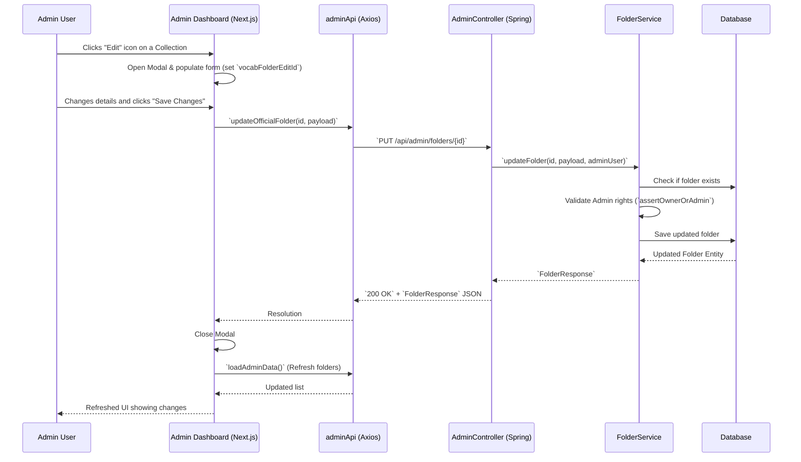
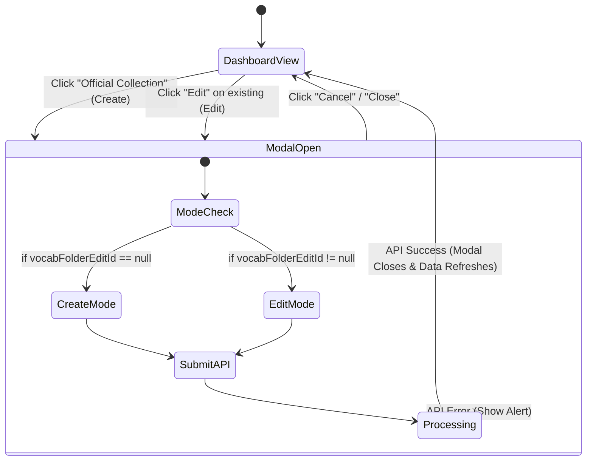

# Admin Vocabulary Management System

## 1. Logic of Implementation (Logic Triển Khai)
The vocabulary system in the application is organized into "Folders" (Collections) and "Lessons" (Study Sets). 
The Admin Dashboard allows administrators to create and curate "Official" collections that are visibly verified (marked with stars and accessible globally).
Recently added features allow for:
- Creating new official collections with customizable colors, icons, names, and descriptions.
- **Editing** an existing official collection to update its styling and name/description.
- **Deleting** a collection permanently, which requires admin verification and clears the folder from the user interface.

These operations are managed via the `AdminController` to enforce strict authorization constraints (only users with the `ADMIN` role can execute these).

## 2. State Management (Quản Lý Trạng Thái)

### 2.1. Client-side State (React/Zustand)
Inside `AdminDashboardContent` (`frontend/src/app/admin/page.tsx`), React hooks are used to manage localized state:
- **`vocabFoldersList`**: An array of `Folder` objects rendered on the dashboard. It gets refreshed each time an action occurs.
- **`vocabFolderModalOpen`**: Boolean indicating the visibility of the "Create/Edit Collection" modal.
- **`vocabFolderEditId`**: Stored as `number | null`. Determines if the modal operates in 'Create' mode (`null`) or 'Edit' mode (`number` matching the ID).
- **Form States**: `vocabFolderName`, `vocabFolderDesc`, `vocabFolderColor`, `vocabFolderIcon` populate the input fields inside the modal.

### 2.2. Server-side Flow
1. **Controller**: `AdminController` maps the HTTP endpoints `/api/v1/admin/folders` (GET, POST) and `/api/v1/admin/folders/{id}` (PUT, DELETE).
2. **Service**: The controller delegates logic to `FolderService`.
3. **Authorization validation**: `assertOwnerOrAdmin` is triggered inside `FolderService` to ensure that either the creator of the folder or an Admin is permitted to execute the update or deletion.
4. **Repository**: `FolderRepository` handles direct access to the database (PostgreSQL), executing the actual save or delete operation.

## 3. Frontend-Backend Integration (Tích hợp FE-BE)

| Method | Path | Request Body / Params | Response | Description |
|---|---|---|---|---|
| `GET` | `/api/admin/folders` | None | `FolderResponse[]` | Fetches all official vocabulary collections. |
| `POST` | `/api/admin/folders` | `FolderRequest` | `FolderResponse` | Creates a new official vocabulary collection. |
| `PUT` | `/api/admin/folders/{id}` | `FolderRequest` | `FolderResponse` | Updates the details of a specific official collection. |
| `DELETE` | `/api/admin/folders/{id}` | Path variable `{id}` | `204 No Content` | Removes the official collection permanently. |

### Payload DTO (`FolderRequest`):
```typescript
{
  name: string;
  description?: string;
  color: string;
  icon: string;
}
```

## 4. Mermaid Diagrams

### 4.1. Sequence Diagram: Editing a Collection



### 4.2. Workflow Diagram: UI State for Collection Action Modal


