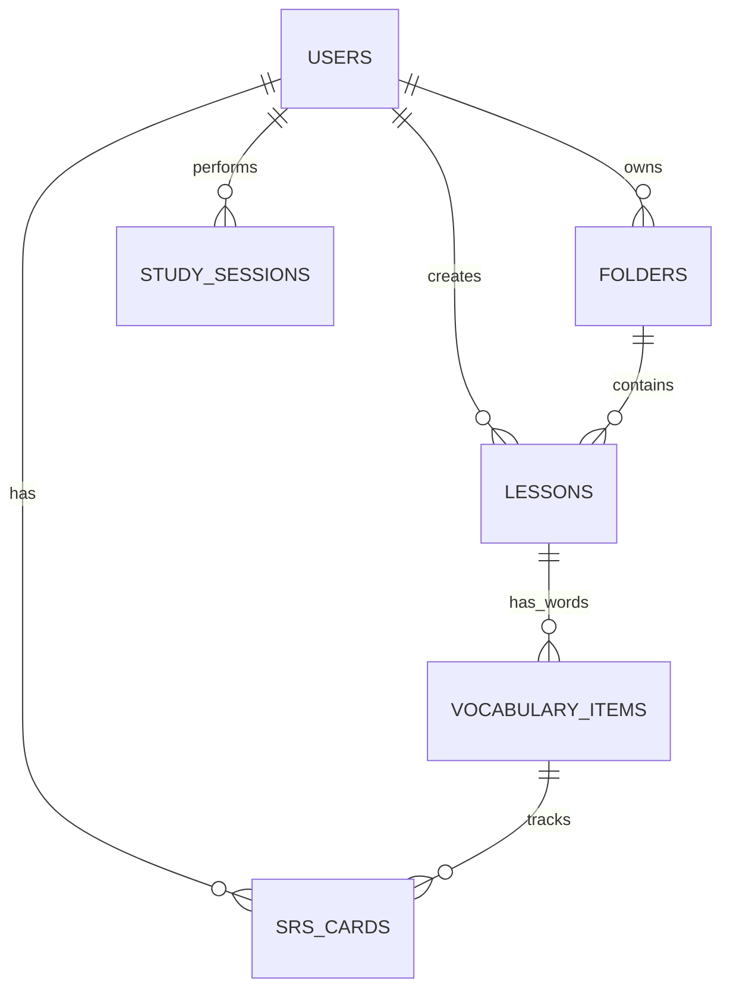

# ☕ Kiến trúc Spring Boot Core Service (Backend Core Architecture)

Tài liệu này chi tiết hóa thiết kế hệ thống, lược đồ cơ sở dữ liệu (Database Schema), cấu trúc API và thuật toán **Spaced Repetition System (SRS)** phía Backend (Spring Boot Core).

---

## 1. Cấu trúc Mô-đun Hệ thống (Project Module Structure)

Backend Core được phát triển bằng **Spring Boot 3** theo mô hình kiến trúc Layered Architecture (Kiến trúc phân tầng):

```
backend/src/main/java/com/langwhich/app/
├── config/             # Spring Security, CORS, JWT Filter & Configuration
├── auth/               # Controller/Service đăng ký, đăng nhập, Token Refresh
├── user/               # Thực thể User, Repositories, Services quản lý tài khoản
├── lesson/             # Quản lý Bài học (Lessons) & Từ vựng (Vocabulary Items)
├── folder/             # Thư mục hệ thống & Thư mục cá nhân của User
├── srs/                # Thuật toán Spaced Repetition (SM-2) & Thẻ SRS
└── history/            # Lịch sử học tập & Session Tracker
```

---

## 2. Thiết kế Cơ sở Dữ liệu (Relational Database Schema)

Hệ thống sử dụng hệ quản trị cơ sở dữ liệu quan hệ **PostgreSQL**. Lược đồ quan hệ chính giữa các bảng (Entity Relations) được biểu diễn như sau:



### Các bảng dữ liệu chính:

#### 2.1 Bảng `users` (Thông tin tài khoản)
* `id` (UUID, Primary Key)
* `username` (VARCHAR, Unique, Not Null)
* `email` (VARCHAR, Unique, Not Null)
* `password_hash` (VARCHAR, Not Null)
* `photo_url` (VARCHAR, Nullable)
* `role` (VARCHAR: `USER`, `ADMIN`)
* `created_at` (TIMESTAMP)

#### 2.2 Bảng `lessons` (Bộ từ vựng)
* `id` (UUID, Primary Key)
* `title` (VARCHAR, Not Null)
* `description` (TEXT)
* `creator_id` (UUID, Foreign Key → `users.id`)
* `word_count` (INTEGER, Default 0)
* `is_private` (BOOLEAN, Default False)
* `is_official` (BOOLEAN, Default False - Do Admin tạo sẽ hiển thị ở trang chủ)
* `folder_id` (UUID, Foreign Key → `folders.id`, Nullable)
* `created_at` (TIMESTAMP)

#### 2.3 Bảng `vocabulary_items` (Danh sách từ trong bộ)
* `id` (UUID, Primary Key)
* `lesson_id` (UUID, Foreign Key → `lessons.id`, On Delete Cascade)
* `word` (VARCHAR, Not Null)
* `definition` (TEXT, Not Null)
* `ipa` (VARCHAR, Nullable) - Phiên âm
* `word_type` (VARCHAR, Nullable) - Loại từ (Noun, Verb, Adj,...)
* `example_en` (TEXT, Nullable) - Ví dụ tiếng Anh
* `example_vi` (TEXT, Nullable) - Dịch nghĩa ví dụ
* `order_index` (INTEGER) - Thứ tự hiển thị

#### 2.4 Bảng `srs_cards` (Thẻ ôn tập Spaced Repetition)
Lưu thông tin trạng thái học tập của từng từ của từng user theo thuật toán học ngắt quãng.
* `id` (UUID, Primary Key)
* `user_id` (UUID, Foreign Key → `users.id`)
* `vocab_item_id` (UUID, Foreign Key → `vocabulary_items.id`)
* `ease_factor` (DOUBLE PRECISION, Default 2.5) - Hệ số ghi nhớ
* `interval_days` (INTEGER, Default 0) - Khoảng cách ngày đến lần ôn tiếp theo
* `repetitions` (INTEGER, Default 0) - Số lần ôn thành công liên tiếp
* `next_review` (TIMESTAMP) - Mốc thời gian đến hạn ôn tập
* `last_review` (TIMESTAMP, Nullable)
* `correct_count` (INTEGER, Default 0)
* `incorrect_count` (INTEGER, Default 0)
* `streak` (INTEGER, Default 0) - Chuỗi trả lời đúng liên tục

#### 2.5 Bảng `study_sessions` (Lịch sử phiên học)
Lưu hoạt động học tập để vẽ heatmap và tính toán thời gian xếp hạng.
* `id` (UUID, Primary Key)
* `user_id` (UUID, Foreign Key → `users.id`)
* `lesson_id` (UUID, Foreign Key → `lessons.id`)
* `study_mode` (VARCHAR: `flashcard`, `review`, `test`, `srs_review`)
* `time_spent` (INTEGER) - Thời gian học (tính bằng giây)
* `know_count` (INTEGER) - Số từ thuộc
* `total_count` (INTEGER) - Tổng số từ trong phiên
* `created_at` (TIMESTAMP)

---

## 3. Thuật toán Spaced Repetition (SM-2 Algorithm)

Hệ thống tự động cá nhân hóa lộ trình ôn tập từ vựng bằng cách tính toán khoảng thời gian tối ưu cho lần gặp lại tiếp theo của từ vựng dựa trên phản hồi của người học.

### Xếp hạng mức độ nhớ (User Quality Rating - `q`):
* `0` (Again): Quên hoàn toàn.
* `3` (Hard): Nhớ mập mờ, mất nhiều thời gian để nghĩ ra đáp án.
* `4` (Good): Nhớ chính xác, có một chút ngập ngừng nhẹ.
* `5` (Easy): Nhớ ngay lập tức, không gặp bất cứ khó khăn nào.

### Logic tính toán (SM-2 Java Implementation):

```java
public SrsCard calculateNextReview(SrsCard card, int quality) {
    double easeFactor = card.getEaseFactor();
    int repetitions = card.getRepetitions();
    int interval = card.getIntervalDays();

    // 1. Cập nhật Ease Factor (Hệ số ghi nhớ)
    // Công thức tiêu chuẩn của SM-2
    easeFactor = easeFactor + (0.1 - (5 - quality) * (0.08 + (5 - quality) * 0.02));
    if (easeFactor < 1.3) {
        easeFactor = 1.3; // Hệ số tối thiểu để tránh khoảng cách quá ngắn
    }

    // 2. Tính toán Repetitions & Interval (Khoảng cách ôn tập tiếp theo)
    if (quality < 3) {
        // Trả lời sai (Again) -> Reset tiến trình của từ này
        repetitions = 0;
        interval = 1; // Ôn lại vào ngày mai
    } else {
        // Trả lời đúng (Hard, Good, Easy) -> Tăng dần khoảng cách ôn tập
        repetitions = repetitions + 1;
        if (repetitions == 1) {
            interval = 1;
        } else if (repetitions == 2) {
            interval = 6;
        } else {
            // Từ lần thứ 3 trở đi: khoảng cách = khoảng cách trước đó * Ease Factor
            double nextInterval = interval * easeFactor;
            
            // Áp dụng Modifier dựa trên độ khó cụ thể
            if (quality == 3) nextInterval *= 0.8;  // Hard -> Rút ngắn khoảng cách ôn tập
            if (quality == 5) nextInterval *= 1.3;  // Easy -> Kéo dài khoảng cách ôn tập
            
            interval = (int) Math.round(nextInterval);
        }
    }

    // 3. Cập nhật các thông số thực thể
    card.setEaseFactor(easeFactor);
    card.setRepetitions(repetitions);
    card.setIntervalDays(interval);
    card.setLastReview(LocalDateTime.now());
    card.setNextReview(LocalDateTime.now().plusDays(interval));
    
    return card;
}
```

---

## 4. Thống kê Hoạt động học tập (Study Activity Stats Logic)

### Luồng render Heatmap (GitHub-style Calendar):
* Lấy lịch sử học tập hàng ngày của người dùng qua API `GET /api/v1/history/daily`.
* Backend đếm số lượng session hoàn thành của từng ngày trong vòng 1 năm qua bằng cách nhóm theo ngày:

```sql
SELECT DATE(created_at) as study_date, COUNT(id) as session_count
FROM study_sessions
WHERE user_id = :userId AND created_at >= NOW() - INTERVAL '1 year'
GROUP BY DATE(created_at);
```
* Trả về Object `{ "YYYY-MM-DD": count }` giúp Frontend render ô màu xanh lục với độ đậm tăng dần theo số phiên học.
