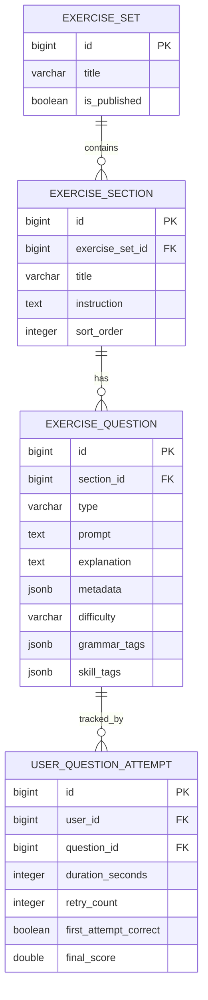
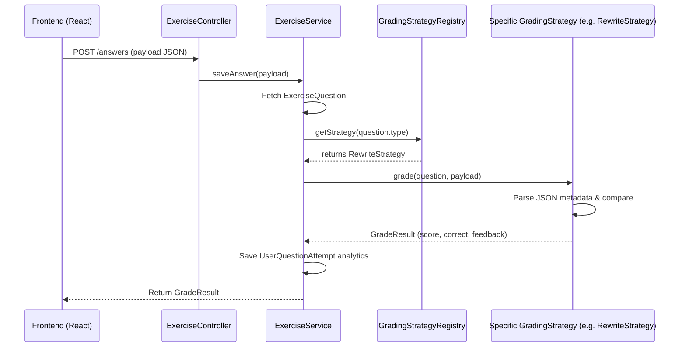

# Exercise Engine v2 (English Learning Platform Core) Architecture

## 1. Logic of Implementation (Logic Triển Khai)

The exercise module has evolved from a basic "Practice Test" feature into a highly scalable **English Learning Platform Core**. The new architecture shifts away from rigid database columns per question type and instead embraces a flexible `metadata (JSONB)` structure and Registry Pattern, allowing unlimited scaling of question types (e.g., Finding Errors, Sentence Rewriting, Drag & Drop, Speaking, etc.) without mutating the schema.

### Core Upgrades
1. **Hierarchical Structure**: `ExerciseSet` -> `ExerciseSection` (Parts) -> `ExerciseQuestion`. This mimics real-world exams (e.g., TOEIC Part 1, IELTS Reading Section 1).
2. **Dynamic Metadata (JSONB)**: Fields like `mistakeText`, `correctAnswers`, `options`, `hint` are stored flexibly inside a JSONB `metadata` column on the question, avoiding schema bloat.
3. **Flexible Submissions**: User answers are submitted as a generic JSON payload (`{"selectedOption": "B"}` or `{"text": "Hello"}`), which the specific Strategy decodes.
4. **Rich Grading Result**: Grading does not just return a boolean `isCorrect`, but a comprehensive `GradeResult` containing partial scores, maximum possible score, detailed feedback, and AI-driven explanations.
5. **Learning Analytics & Tracking**: Introduces `UserQuestionAttempt` to track `duration`, `retryCount`, and `firstAttemptCorrect` per question to fuel Adaptive Learning, Spaced Repetition, and Skill Tracking.
6. **Dual Modes**: 
   - **Study Mode**: Immediate feedback, explanation revealed after attempting.
   - **Exam Mode**: Strict countdown, locked navigation, feedback hidden until final submission.

---

## 2. State Management (Quản Lý Trạng Thái)

### 2.1. Backend Flow (Strategy & Registry Patterns)
* **Controller**: `ExerciseController` handles standardized request payloads.
* **Service**: `ExerciseService` delegates to a `GradingStrategyRegistry`.
* **Grading Strategy**: Each question type (e.g., `SentenceRewriteStrategy`, `FindAndCorrectStrategy`) implements an interface returning `GradeResult`.

```java
public interface GradingStrategy {
    boolean supports(ExerciseType type);
    GradeResult grade(ExerciseQuestion question, JsonNode userPayload);
}

public class GradeResult {
    private double score;
    private double maxScore;
    private boolean correct;
    private String feedback;
    private String explanation;
}
```

### 2.2. Frontend Architecture (Registry Pattern)
Instead of massive `if/else` statements, the Frontend dynamically resolves the correct component renderer for the given question type using a Registry Object.

```tsx
const QuestionComponentRegistry = {
  MULTIPLE_CHOICE: MCQRenderer,
  FILL_IN_BLANK: FillBlankRenderer,
  FIND_AND_CORRECT: FindAndCorrectRenderer,
  SENTENCE_REWRITE: RewriteRenderer,
};

// Rendering:
const Renderer = QuestionComponentRegistry[question.type] || DefaultRenderer;
<Renderer question={question} onAnswer={handleAnswer} />
```

---

## 3. Data Models & JSON Metadata

### 3.1. Entity Hierarchy
- **`ExerciseSet`**: The full test/practice set.
- **`ExerciseSection`**: Groups questions logically (e.g., "Part 1: Grammar", "Part 2: Vocabulary").
- **`ExerciseQuestion`**: Contains core attributes (`prompt`, `explanation`, `type`, `difficulty`, `tags`) and type-specific JSONB `metadata`.
- **`UserQuestionAttempt`**: Tracks attempts at the question level for skill profiling.

### 3.2. Example Metadata Structures

**Multiple Choice (`MULTIPLE_CHOICE`)**
```json
{
  "options": [
    {"key": "A", "content": "go"},
    {"key": "B", "content": "goes"}
  ],
  "correctAnswer": "B"
}
```

**Find & Correct (`FIND_AND_CORRECT`)**
```json
{
  "mistakeText": "have",
  "acceptedAnswers": ["has"]
}
```

**Sentence Rewrite (`SENTENCE_REWRITE`)**
```json
{
  "keyword": "have",
  "acceptedAnswers": [
    "they have worked here for 5 years",
    "they have been working here for 5 years"
  ]
}
```

**Learning Attributes (on `ExerciseQuestion`)**
```json
{
  "difficulty": "B1",
  "grammarTags": ["present-perfect", "since-for"],
  "skillTags": ["reading", "grammar-accuracy"]
}
```

---

## 4. Frontend-Backend Integration (Tích hợp FE-BE)

### Submission Payload
Instead of specific fields in DTOs, the frontend submits a flexible map/JSON node:

```json
POST /api/exercises/attempts/{attemptId}/answers
{
  "questionId": 105,
  "payload": {
    "text": "they have worked here for 5 years"
  }
}
```

---

## 5. Mermaid Diagrams

### 5.1. Entity Relationship Diagram (ERD v2)



### 5.2. Submission & Grading Flow



---

## 6. Implementation Phases

**Phase 1 — Core Infrastructure**
- Implement `ExerciseSection` entity.
- Migrate from fixed columns to JSONB `metadata`.
- Implement `GradeResult` and generic `payload` submission.
- Build Frontend Component Registry Architecture.

**Phase 2 — Admin Editor & Quick Import**
- Upgrade Admin Editor to a Tree structure (Set -> Sections -> Questions).
- Add Drag & Drop sorting.
- Update `QuickImportForm` to parse Section headers and JSON blocks.

**Phase 3 — Learning Engine & Analytics**
- Implement `UserQuestionAttempt` tracking.
- Build review systems and weakness detection dashboards.
- Introduce Study Mode vs. Exam Mode configurations.
