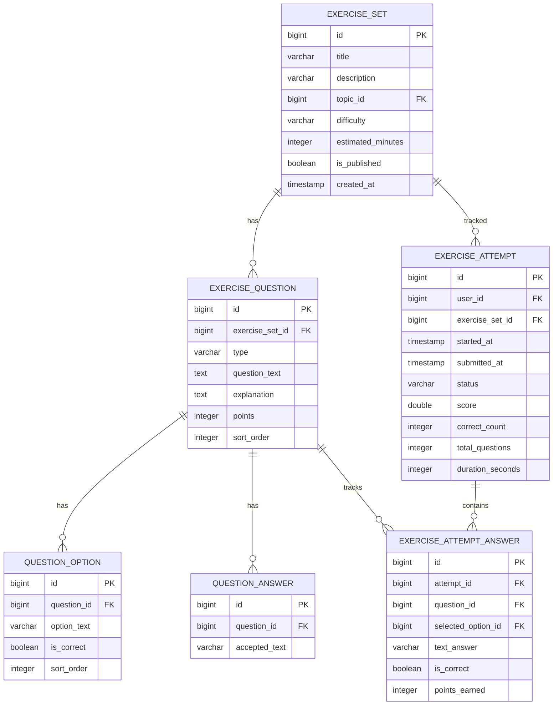

# Exercise Practice Module Architecture

## 1. Logic of Implementation (Logic Triển Khai)

This module handles the practice lifecycle for users. It is designed to be highly extensible (using the Strategy Pattern) to support different types of questions, beginning with multiple-choice and fill-in-the-blank, and expanding into listening, writing, matching, and speaking.

### Step-by-Step Practice Workflow:
1. **Listing and Filtering**: Users browse available exercise sets on the listing page, filtered by Topic and Difficulty.
2. **Session Initialization / Recovery**: When a user clicks "Start Practice", the system requests the backend to initialize an attempt session. If there is an active `IN_PROGRESS` attempt for this user and set, the system performs **Session Recovery** and resumes the existing attempt, preserving previously recorded answer inputs.
3. **Timer and Progress**: A client-side timer records duration. A progress bar displays the percentage of questions answered.
4. **Debounced Autosave**: As the user answers a question, the input is immediately updated in the Zustand store. A custom hook debounces changes (1 second inactivity delay) and makes background API calls to auto-save the answer, marking it as synced on the Question Navigation Palette.
5. **Submission and Grading**: Upon submitting, the Exercise Engine grades all questions by routing each to its specific registered `GradingStrategy` (e.g., correct option comparison, case-insensitive trimmed whitespace normalization for fill-in-blank). The attempt's status changes to `COMPLETED`, calculating total score, correctness count, and duration.
6. **Detailed Review**: The user is navigated to a static review board where correct and user-selected options are displayed alongside detailed grammar and semantic explanations.

---

## 2. State Management (Quản Lý Trạng Thái)

### 2.1. Client-side State (Zustand Store)
`usePracticeStore` holds the state of the active practice session, utilizing `createJSONStorage()` to persist values in `localStorage` in case of refreshes.

* **State Fields**:
  - `attemptId: number | null` - Current active practice attempt session ID.
  - `exerciseSet: ExerciseSetDetail | null` - The active set metadata (questions, options, points).
  - `currentQuestionIndex: number` - Slide-by-slide active index.
  - `answers: Record<number, { selectedOptionId?: number | null, textAnswer?: string | null }>` - User's inputs mapped by question ID.
  - `savedAnswers: Record<number, boolean>` - Synced status (clean/dirty) per question.
  - `timerSeconds: number` - Seconds spent.
* **Actions**:
  - `initPractice(attemptId, set)` - Initialize state or preserve current attempt.
  - `setQuestionIndex(index)` - Navigates to question index.
  - `updateAnswer(questionId, data)` - Captures selection and marks it dirty.
  - `markAsSaved(questionId, status)` - Callback to set synced state.
  - `incrementTimer()` - Ticks clock.
  - `clearPractice()` - Resets store to initial state.

### 2.2. Server-side Flow
Standard Spring Boot layered execution chain:
`ExerciseController` ➔ `ExerciseService` ➔ `GradingStrategy` / Repository ➔ PostgreSQL DB.

---

## 3. Frontend-Backend Integration (Tích hợp FE-BE)

### 3.1. API Endpoints and Mappings

| HTTP Method | API Path | Request DTO / Payload | Response DTO / Structure | Auth |
| :--- | :--- | :--- | :--- | :--- |
| **GET** | `/api/exercises` | Topic, difficulty, search, pageable | `Page<ExerciseSetResponse>` | Public |
| **GET** | `/api/exercises/{id}` | None | `ExerciseSetDetailResponse` | Public |
| **POST** | `/api/exercises/{id}/start` | None | `StartAttemptResponse` (attemptId) | Secured |
| **GET** | `/api/exercises/attempts/{attemptId}` | None | `ActiveAttemptResponse` (session recovery) | Secured |
| **POST** | `/api/exercises/attempts/{attemptId}/answers` | `SaveAnswerRequest` | `SaveAnswerResponse` (success/message) | Secured |
| **POST** | `/api/exercises/attempts/{attemptId}/submit` | None | `SubmitAttemptResponse` (final score/time) | Secured |
| **GET** | `/api/exercises/attempts/{attemptId}/review` | None | `AttemptReviewResponse` (all answers/explanations) | Secured |

---

## 4. Mermaid Diagrams

### 4.1. Practice Sequence & Autosave Diagram

```mermaid
sequenceDiagram
    autonumber
    actor Student
    participant Browser as React / Next.js Front
    participant Store as Zustand Store
    participant Server as Spring Boot API
    database DB as PostgreSQL

    Student->>Browser: Click Start Practice
    Browser->>Server: POST /api/exercises/{setId}/start
    Server->>DB: Check or Create Attempt (IN_PROGRESS)
    DB-->>Server: Return Attempt Entity
    Server-->>Browser: Return attemptId
    Browser->>Server: GET /api/exercises/attempts/{attemptId}
    Server-->>Browser: Return active session data (recovery)
    Browser->>Store: initPractice() & restore answers
    
    loop Practice Session
        Student->>Browser: Select Option / Type Input
        Browser->>Store: updateAnswer() [marked dirty]
        Note over Browser,Store: 1s Debounce Timeout triggers
        Browser->>Server: POST /api/exercises/attempts/{attemptId}/answers
        Server->>DB: Grade and save answer
        Server-->>Browser: Return Success
        Browser->>Store: markAsSaved() [marked clean]
    end

    Student->>Browser: Click Submit Practice
    Browser->>Server: POST /api/exercises/attempts/{attemptId}/submit
    Server->>DB: Mark attempt as COMPLETED, compute final metrics
    Server-->>Browser: Return SubmitAttemptResponse
    Browser->>Store: clearPractice()
    Browser->>Server: GET /api/exercises/attempts/{attemptId}/review
    Server-->>Browser: Return AttemptReviewResponse (detailed explanations)
    Browser-->>Student: Display Review Scoreboard
```

### 4.2. Entity Relationship Diagram (ERD)


