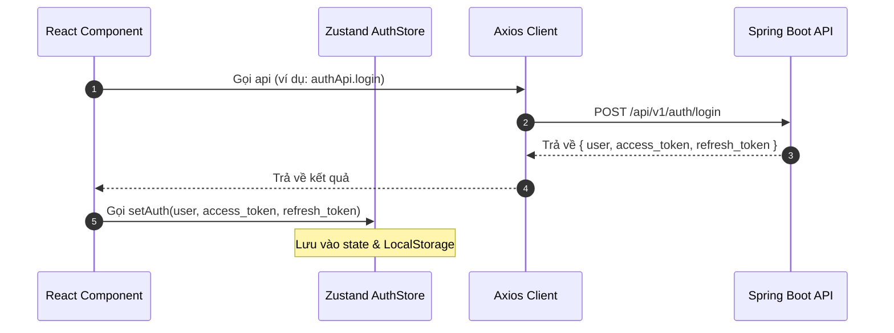

# 🔐 Kiến trúc Xác thực & Bảo mật (Frontend Authentication Architecture)

Tài liệu này trình bày cách thiết kế và triển khai luồng xác thực (Authentication), phân quyền (Authorization) và quản lý token ở phía Client (Next.js) bằng **Zustand** và **Axios Interceptors**.

---

## 1. Quản lý Client State bằng Zustand (`useAuthStore`)

Để lưu trữ thông tin đăng nhập của người dùng một cách tập trung, an toàn và dễ truy cập giữa các React Components, hệ thống sử dụng **Zustand Store** được tích hợp middleware `persist` để tự động đồng bộ hóa trạng thái đăng nhập xuống `localStorage`.

### Chi tiết thiết kế:
* **File nguồn**: [auth.store.ts](file:///f:/Project/english-application/langwhich-website-project/frontend/src/store/auth.store.ts)
* **State & Action Structure**:

```typescript
interface AuthState {
  // --- States ---
  user: User | null;              // Thông tin người dùng hiện tại (id, username, email, role,...)
  accessToken: string | null;     // Token dùng để xác thực các request API ngắn hạn
  refreshToken: string | null;    // Token dùng để tự động cấp lại accessToken khi hết hạn
  isAuthenticated: boolean;       // Trạng thái đã đăng nhập hay chưa
  _hasHydrated: boolean;          // Cờ kiểm tra Zustand store đã hoàn tất hydration từ localStorage chưa

  // --- Actions ---
  setAuth: (user: User, accessToken: string, refreshToken: string) => void;
  clearAuth: () => void;
  updateTokens: (accessToken: string, refreshToken?: string) => void;
  setHasHydrated: (state: boolean) => void;
}
```

### Cơ chế Persist an toàn với SSR (Server-Side Rendering)
Do Next.js sử dụng cơ chế Server-Side Rendering (SSR), `window` và `localStorage` sẽ không tồn tại ở phía Server. Để tránh lỗi hydration mismatch, `useAuthStore` sử dụng một wrapper custom storage:

```typescript
storage: createJSONStorage(() =>
  typeof window !== "undefined" ? localStorage : {
    getItem: () => null,
    setItem: () => {},
    removeItem: () => {},
  }
)
```

Đồng thời, khi thực hiện `setAuth`, `clearAuth` hoặc `updateTokens`, store luôn kiểm tra `typeof window !== "undefined"` trước khi thực hiện thao tác thủ công trên `localStorage` để đồng bộ hóa cho Axios.

---

## 2. Luồng Xử lý Token Tự động (Token Rotation)

Sự kết hợp giữa `useAuthStore` và Axios Interceptor giúp che giấu toàn bộ độ phức tạp của việc xoay vòng token khỏi các components. 



### Các bước tích hợp:
1. **Đăng nhập/Đăng ký thành công**:
   * API trả về payload chứa thông tin người dùng và bộ đôi token (`accessToken` & `refreshToken`).
   * Component gọi `setAuth()` để cập nhật state toàn cục và lưu trữ token.
2. **Gửi API Request**:
   * `apiClient` tự động lấy `access_token` từ `localStorage` để gắn vào header `Authorization: Bearer <token>`.
3. **Khi Access Token hết hạn**:
   * Response trả về status `401`.
   * Interceptor tự động kích hoạt tiến trình refresh token, gửi yêu cầu tới `/auth/refresh-token` với `refreshToken` cũ.
   * Nếu thành công: Lưu `access_token` mới, ghi đè header và thực hiện lại request lỗi (Retry) mà không cần người dùng tải lại trang.
   * Nếu thất bại: Gọi `clearAuth()`, đưa người dùng về trang đăng nhập.

---

## 3. Bảo vệ Route & Phân quyền (Route Guards)

Để bảo vệ các trang yêu cầu đăng nhập (Ví dụ: Dashboard, Học từ vựng, Quản lý Admin), hệ thống áp dụng cơ chế bảo vệ phân tầng:

### Tầng 1: Client-Side Component Guard
Sử dụng các component Wrapper để kiểm tra quyền truy cập trước khi render nội dung chính.

* **Trang thông thường yêu cầu đăng nhập (`(protected)` pages)**:
  * Đọc `isAuthenticated` và `_hasHydrated` từ `useAuthStore`.
  * Chỉ thực hiện kiểm tra quyền truy cập và chuyển hướng khi `_hasHydrated === true`. Nếu `isAuthenticated === false`, dùng `useRouter()` hoặc `redirect()` để chuyển hướng sang `/auth/login`. Việc này ngăn chặn triệt để tình trạng race condition khi người dùng tải lại trang (F5) khiến hệ thống ngộ nhận người dùng chưa đăng nhập trước khi store kịp load dữ liệu từ localStorage.
* **Trang Admin (`(admin)` pages)**:
  * Đọc `user`, `_hasHydrated` và kiểm tra `user.role === 'ADMIN'`.
  * Đợi `_hasHydrated === true` trước khi chuyển hướng trái phép hoặc chuyển tiếp nội dung. Nếu không phải Admin, chuyển hướng về trang chủ `/` kèm thông báo từ chối quyền truy cập.
