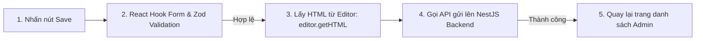

# 📝 Kiến trúc Module Lý thuyết & Tiptap Editor (Theory Client Architecture)

Tài liệu này mô tả chi tiết logic triển khai phần hiển thị bài học lý thuyết (TOEIC Theory) và trình soạn thảo Rich Text chuyên nghiệp **Tiptap Editor** dành cho quản trị viên (Admin).

---

## 1. Cấu trúc Routing & Phân Quyền (Theory Routing Structure)

Module Lý thuyết được chia làm hai khu vực chính dựa trên vai trò của người dùng:

### Khu vực Người học (User Area):
* `/theory` (`theory/page.tsx`): Hiển thị danh sách các chủ đề lý thuyết lớn (ví dụ: Tenses, Passive Voice, Gerund & Infinitive).
* `/theory/[id]` (`theory/[id]/page.tsx`): Xem nội dung bài học lý thuyết chi tiết với định dạng Rich Text đầy đủ.

### Khu vực Quản lý (Admin Area):
* `/admin/theory` (`admin/theory/page.tsx`): Bảng điều khiển quản lý danh mục chủ đề, bài học lý thuyết, hỗ trợ xóa/sửa.
* `/admin/theory/lessons/create` (`admin/theory/lessons/create/page.tsx`): Tạo bài học lý thuyết mới bằng Tiptap Editor.
* `/admin/theory/lessons/[id]/edit` (`admin/theory/lessons/[id]/edit/page.tsx`): Chỉnh sửa bài học lý thuyết hiện có.

---

## 2. Trình soạn thảo Rich Text Tiptap (Rich Text Integration)

Để cho phép biên soạn các bài giảng lý thuyết ngữ pháp TOEIC sinh động (có bảng biểu, highlight, hình ảnh, văn bản định dạng phong phú), hệ thống tích hợp **Tiptap Editor** - một thư viện editor headless mạnh mẽ dựa trên ProseMirror.

### Cấu hình Extension Tiptap:
Các extension được cấu hình tại [package.json](file:///f:/Project/english-application/langwhich-website-project/frontend/package.json) và tích hợp trong editor component:
* `StarterKit`: Bao gồm các định dạng cơ bản như Bold, Italic, Headings, Bullet List, Order List, Blockquote.
* `Highlight`: Đánh dấu/highlight các phần cấu trúc ngữ pháp quan trọng trong bài giảng.
* `Underline`: Gạch chân chữ.
* `Image`: Nhúng hình ảnh minh họa cho bài học.
* `Table`, `TableCell`, `TableHeader`, `TableRow`: Tạo bảng biểu so sánh cấu trúc ngữ pháp trực quan.

### Quản lý State trong Form Soạn thảo:
Tiptap Editor được tích hợp chặt chẽ với **React Hook Form** và **Zod** để xử lý validation dữ liệu trước khi gửi lên server.

---

## 3. Tích hợp NestJS Backend APIs (`theory.api.ts`)

Khác với các module khác dùng Spring Boot, module Lý thuyết giao tiếp trực tiếp với **NestJS Theory Service** để đảm bảo khả năng xử lý tài liệu động linh hoạt trên MongoDB.

* **API Client file**: [theory.api.ts](file:///f:/Project/english-application/langwhich-website-project/frontend/src/api/theory.api.ts)
* **Các Endpoint chính**:

| Method | Endpoint | Mô tả |
| :--- | :--- | :--- |
| `GET` | `/theory/topics` | Lấy danh sách các chủ đề (chứa nhiều bài học). |
| `GET` | `/theory/lessons` | Lấy danh sách bài học lý thuyết (có lọc theo Topic). |
| `GET` | `/theory/lessons/{id}` | Lấy chi tiết nội dung bài học lý thuyết (kèm mã HTML). |
| `POST` | `/theory/lessons` | (Admin) Tạo một bài học lý thuyết mới. |
| `PUT` | `/theory/lessons/{id}` | (Admin) Cập nhật nội dung bài học lý thuyết. |
| `DELETE` | `/theory/lessons/{id}` | (Admin) Xóa bài học lý thuyết. |
