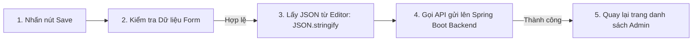

# 📝 Kiến trúc Module Lý thuyết & Tiptap Editor (Theory Client Architecture)

Tài liệu này mô tả chi tiết logic triển khai phần hiển thị bài học lý thuyết (TOEIC Theory) và trình soạn thảo Rich Text chuyên nghiệp **Tiptap Editor** dành cho quản trị viên (Admin), tích hợp với **Spring Boot** + **PostgreSQL**.

---

## 1. Cấu trúc Routing & Phân Quyền (Theory Routing Structure)

Module Lý thuyết được chia làm hai khu vực chính dựa trên vai trò của người dùng:

### Khu vực Người học (User Area):
* `/theory` (`theory/page.tsx`): Hiển thị danh sách các chủ đề lý thuyết lớn (ví dụ: Listening Comprehension, Grammar Tracks).
* `/theory/[topicSlug]` (`theory/[topicSlug]/page.tsx`): Xem danh sách bài học thuộc chủ đề cụ thể (Slug-based URL).
* `/theory/[topicSlug]/[lessonSlug]` (`theory/[topicSlug]/[lessonSlug]/page.tsx`): Xem chi tiết bài học lý thuyết với Rich Text đầy đủ, hỗ trợ chuyển hướng bài học trước/sau (Lesson Navigation).

### Khu vực Quản lý (Admin Area):
* `/admin/theory/lessons` (`admin/theory/lessons/page.tsx`): Quản lý danh sách bài học lý thuyết, hỗ trợ Tìm kiếm, phân trang và trạng thái Draft/Published.
* `/admin/theory/topics` (`admin/theory/topics/page.tsx`): Quản lý các danh mục chủ đề, thứ tự hiển thị (Sort Index) và icon tương ứng.
* `/admin/theory/lessons/create` (`admin/theory/lessons/create/page.tsx`): Tạo bài học lý thuyết mới bằng Tiptap Editor.
* `/admin/theory/lessons/[id]/edit` (`admin/theory/lessons/[id]/edit/page.tsx`): Chỉnh sửa bài học lý thuyết hiện có.

---

## 2. Trình soạn thảo Rich Text Tiptap (Rich Text Integration)

Để cho phép biên soạn các bài giảng lý thuyết ngữ pháp TOEIC sinh động (có bảng biểu, highlight, hình ảnh, văn bản định dạng phong phú), hệ thống tích hợp **Tiptap Editor** - một thư viện editor headless mạnh mẽ dựa trên ProseMirror.

### Cấu hình Extension Tiptap:
Các extension được cấu hình tại [package.json](file:///f:/Project/english-application/langwhich-website-project/frontend/package.json) và tích hợp trong editor component:
* `StarterKit`: Bao gồm các định dạng cơ bản như Bold, Italic, Headings, Bullet List, Order List, Blockquote.
* `Highlight`: Đánh dấu/highlight các phần cấu trúc ngữ pháp quan trọng trong bài giảng.
* `Underline`: Gạch chân chữ.
* `Image`: Nhúng hình ảnh minh họa cho bài học.
* `Table`, `TableCell`, `TableHeader`, `TableRow`: Tạo bảng biểu so sánh cấu trúc ngữ pháp trực quan.

### Quản lý State trong Form Soạn thảo:
Dữ liệu của bài soạn được lưu dưới dạng chuỗi JSON thô (`content` dạng `TEXT` trong DB) để đảm bảo độ tương thích cao và ngăn chặn tấn công XSS khi render.

---

## 3. Tích hợp Spring Boot Backend APIs (`theory.api.ts`)

Module Lý thuyết giao tiếp trực tiếp với **Spring Boot API** kết nối cơ sở dữ liệu **PostgreSQL** thông qua JPA Hibernate.

* **API Client file**: [theory.api.ts](file:///f:/Project/english-application/langwhich-website-project/frontend/src/api/theory.api.ts)
* **Các Endpoint Public**:

| Method | Endpoint | Mô tả |
| :--- | :--- | :--- |
| `GET` | `/api/theory/topics` | Lấy danh sách các chủ đề đã Publish. |
| `GET` | `/api/theory/topics/{slug}` | Xem chi tiết thông tin 1 Topic. |
| `GET` | `/api/theory/lessons` | Lấy danh sách tất cả bài học (phân trang, filter search/difficulty). |
| `GET` | `/api/theory/lessons/{slug}` | Xem chi tiết bài giảng theo slug, tăng View Count. |
| `GET` | `/api/theory/topics/{slug}/lessons` | Danh sách bài giảng của một Topic cụ thể. |
| `GET` | `/api/theory/lessons/{id}/navigation` | Lấy thông tin bài học trước/sau. |

* **Các Endpoint Admin** (Yêu cầu vai trò ADMIN):

| Method | Endpoint | Mô tả |
| :--- | :--- | :--- |
| `GET` | `/api/admin/theory/topics` | Danh sách tất cả topic (gồm cả bản nháp). |
| `POST` | `/api/admin/theory/topics` | Tạo mới một Topic. |
| `PATCH` | `/api/admin/theory/topics/{id}` | Cập nhật thông tin Topic. |
| `DELETE` | `/api/admin/theory/topics/{id}` | Xóa Topic (cascade xóa bài học liên quan). |
| `GET` | `/api/admin/theory/lessons` | Danh sách tất cả bài học (phân trang). |
| `POST` | `/api/admin/theory/lessons` | Tạo mới một bài học lý thuyết. |
| `PATCH` | `/api/admin/theory/lessons/{id}` | Cập nhật thông tin bài học. |
| `DELETE` | `/api/admin/theory/lessons/{id}` | Xóa bài học lý thuyết. |
