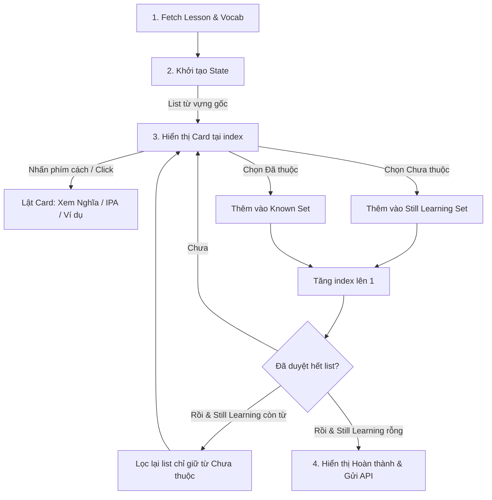
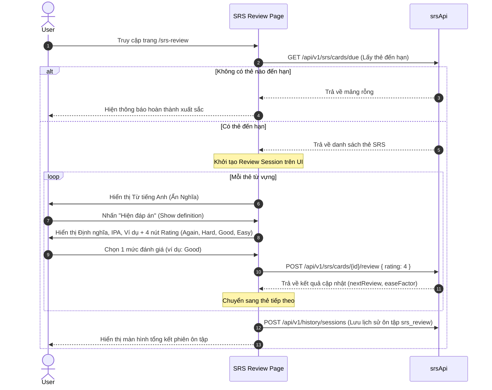

# 📚 Kiến trúc Module Học Từ Vựng (Vocabulary Client Architecture)

Tài liệu này chi tiết hóa luồng xử lý giao diện, quản lý state và tích hợp API cho các chế độ học từ vựng phía Client (Next.js) bao gồm: **Flashcard (Thẻ ghi nhớ)**, **Review (Trắc nghiệm)**, **Test (Điền từ)**, và **SRS Review (Ôn tập ngắt quãng)**.

---

## 1. Màn hình Học Flashcard (`/study/[lessonId]`)

Chế độ học Flashcard cho phép người dùng học từ vựng bằng thẻ 3D lật tương tác, tự phân loại từ đã thuộc hoặc cần học lại.

### Sơ đồ Logic Quản lý State:

### Triển khai State tại Component:
Màn hình Flashcard không dùng global store mà quản lý bằng local state phối hợp để đạt hiệu năng tối ưu (tránh re-render không đáng có):
* `words`: Danh sách từ vựng hiện đang học trong vòng lặp này.
* `currentIndex`: Vị trí thẻ hiện tại.
* `isFlipped`: Trạng thái lật của thẻ hiện tại.
* `knownIds` & `learningIds`: Danh sách phân loại từ để tính toán % tiến trình học.
* **Text-to-Speech Hook (`useSpeechSynthesis`)**: Cho phép click vào icon loa để phát âm chuẩn từ vựng bằng Web Speech API.

### Tích hợp Backend APIs:
Khi hoàn thành (tất cả từ đều nằm trong `Known Set`):
1. **Lưu lịch sử**: Gửi request `POST /api/v1/history/sessions` thông qua `historyApi.saveStudySession` với `studyMode: 'flashcard'`.
2. **Khởi tạo SRS**: Gửi request `POST /api/v1/srs/lessons/{lessonId}/init` để tự động tạo thẻ Spaced Repetition (SRS) trên server cho bộ từ này.

---

## 2. Màn hình Trắc nghiệm (`/review/[lessonId]`)

Chế độ ôn tập trắc nghiệm tự động sinh ra 4 đáp án lựa chọn cho từng từ vựng dựa trên danh sách từ hiện tại của bài học.

### Logic Sinh Đáp Án Nhiễu (Distractors Generator):
Để đảm bảo trải nghiệm học tốt, 3 lựa chọn sai (nhiễu) được tạo ra động:
1. Lấy tất cả từ trong bài học loại trừ từ hiện tại.
2. Xáo trộn ngẫu nhiên danh sách.
3. Chọn ra 3 định nghĩa đầu tiên.
4. Trộn 3 định nghĩa này với định nghĩa đúng của từ hiện tại thành danh sách 4 phần tử xáo trộn.

### Luồng lưu trữ tiến trình:
* Khi hoàn thành toàn bộ bài trắc nghiệm, client tính toán `correctCount` và `totalCount`.
* Thực hiện gọi `historyApi.saveStudySession` với `studyMode: 'review'` kèm thông tin thời gian làm bài (`timeSpent`).

---

## 3. Màn hình Kiểm tra Điền Từ (`/test/[lessonId]`)

Chế độ kiểm tra viết giúp tăng khả năng ghi nhớ chính tả của từ vựng một cách tối đa.

### Logic hiển thị trợ giúp trực quan (Input Guide Lines):
* Với từ cần điền (Ví dụ: `apple`), client hiển thị gợi ý độ dài dưới dạng các gạch dưới phân tách: `_ _ _ _ _`.
* Khi người dùng gõ vào ô input:
  * Client tự động so khớp từng ký tự (case-insensitive).
  * Ký tự gõ đúng sẽ hiển thị đè lên gạch dưới (`a p _ _ _`).
  * Ký tự sai sẽ giữ nguyên ký tự gạch dưới để gợi ý cho người dùng.
* Hỗ trợ phím tắt `Enter` để Submit nhanh và `Ctrl + Space` để Skip (Bỏ qua từ).

---

## 4. Màn hình Ôn tập SRS Thông Minh (`/srs-review`)

Trang ôn tập ngắt quãng cá nhân hóa hàng ngày, tự động tải các từ đã đến hạn kiểm tra (due) của người dùng dựa theo thuật toán SM-2.

### Luồng State & Giao tiếp API:

**Chi tiết API tương tác:**
* `srsApi.getDueCards()`: Fetch danh sách thẻ SRS đến hạn.
* `srsApi.reviewCard(cardId, rating)`: Gửi đánh giá độ khó lên server ngay lập tức cho từng thẻ để server tính toán khoảng cách ôn tập tiếp theo (SM-2 Algorithm).
