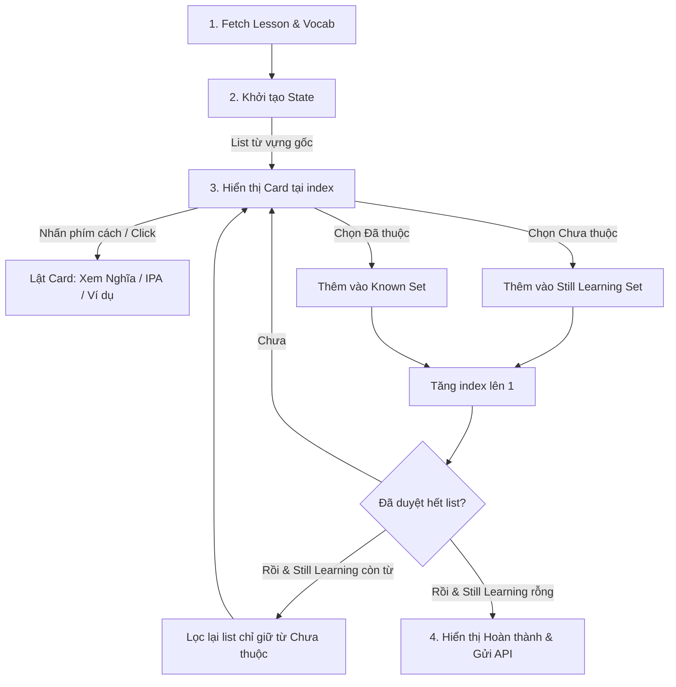
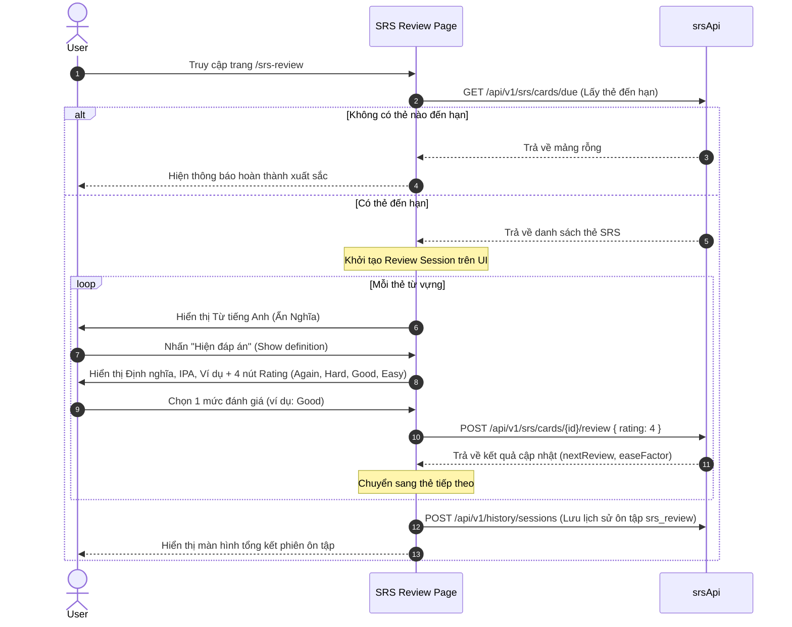
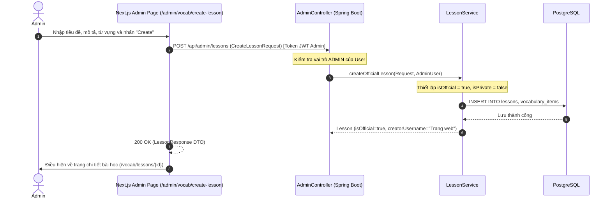
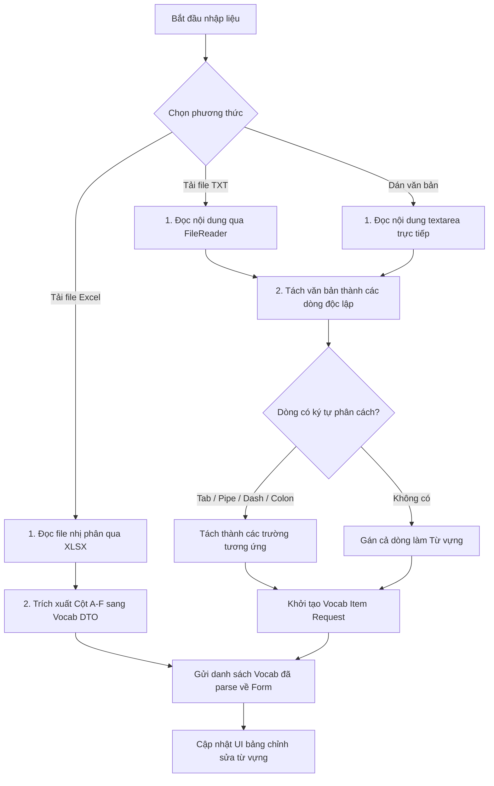

# 📚 Kiến trúc Module Học Từ Vựng (Vocabulary Client Architecture)

Tài liệu này chi tiết hóa luồng xử lý giao diện, quản lý state và tích hợp API cho các chế độ học từ vựng phía Client (Next.js) bao gồm: **Flashcard (Thẻ ghi nhớ)**, **Review (Trắc nghiệm)**, **Test (Điền từ)**, và **SRS Review (Ôn tập ngắt quãng)**.

---

## 1. Màn hình Học Flashcard (`/study/[lessonId]`)

Chế độ học Flashcard cho phép người dùng học từ vựng bằng thẻ 3D lật tương tác, tự phân loại từ đã thuộc hoặc cần học lại.

### Sơ đồ Logic Quản lý State:

### Triển khai State tại Component:
Màn hình Flashcard không dùng global store mà quản lý bằng local state phối hợp để đạt hiệu năng tối ưu (tránh re-render không đáng có):
* `words`: Danh sách từ vựng hiện đang học trong vòng lặp này.
* `currentIndex`: Vị trí thẻ hiện tại.
* `isFlipped`: Trạng thái lật của thẻ hiện tại.
* `knownIds` & `learningIds`: Danh sách phân loại từ để tính toán % tiến trình học.
* **Text-to-Speech Hook (`useSpeechSynthesis`)**: Cho phép click vào icon loa để phát âm chuẩn từ vựng bằng Web Speech API.

### Tích hợp Backend APIs:
Khi hoàn thành (tất cả từ đều nằm trong `Known Set`):
1. **Lưu lịch sử**: Gửi request `POST /api/v1/history/sessions` thông qua `historyApi.saveStudySession` với `studyMode: 'flashcard'`.
2. **Khởi tạo SRS**: Gửi request `POST /api/v1/srs/lessons/{lessonId}/init` để tự động tạo thẻ Spaced Repetition (SRS) trên server cho bộ từ này.

---

## 2. Màn hình Trắc nghiệm (`/review/[lessonId]`)

Chế độ ôn tập trắc nghiệm tự động sinh ra 4 đáp án lựa chọn cho từng từ vựng dựa trên danh sách từ hiện tại của bài học.

### Logic Sinh Đáp Án Nhiễu (Distractors Generator):
Để đảm bảo trải nghiệm học tốt, 3 lựa chọn sai (nhiễu) được tạo ra động:
1. Lấy tất cả từ trong bài học loại trừ từ hiện tại.
2. Xáo trộn ngẫu nhiên danh sách.
3. Chọn ra 3 định nghĩa đầu tiên.
4. Trộn 3 định nghĩa này với định nghĩa đúng của từ hiện tại thành danh sách 4 phần tử xáo trộn.

### Luồng lưu trữ tiến trình:
* Khi hoàn thành toàn bộ bài trắc nghiệm, client tính toán `correctCount` và `totalCount`.
* Thực hiện gọi `historyApi.saveStudySession` với `studyMode: 'review'` kèm thông tin thời gian làm bài (`timeSpent`).

---

## 3. Màn hình Kiểm tra Điền Từ (`/test/[lessonId]`)

Chế độ kiểm tra viết giúp tăng khả năng ghi nhớ chính tả của từ vựng một cách tối đa.

### Logic hiển thị trợ giúp trực quan (Input Guide Lines):
* Với từ cần điền (Ví dụ: `apple`), client hiển thị gợi ý độ dài dưới dạng các gạch dưới phân tách: `_ _ _ _ _`.
* Khi người dùng gõ vào ô input:
  * Client tự động so khớp từng ký tự (case-insensitive).
  * Ký tự gõ đúng sẽ hiển thị đè lên gạch dưới (`a p _ _ _`).
  * Ký tự sai sẽ giữ nguyên ký tự gạch dưới để gợi ý cho người dùng.
* Hỗ trợ phím tắt `Enter` để Submit nhanh và `Ctrl + Space` để Skip (Bỏ qua từ).

---

## 4. Màn hình Ôn tập SRS Thông Minh (`/srs-review`)

Trang ôn tập ngắt quãng cá nhân hóa hàng ngày, tự động tải các từ đã đến hạn kiểm tra (due) của người dùng dựa theo thuật toán SM-2.

### Luồng State & Giao tiếp API:

**Chi tiết API tương tác:**
* `srsApi.getDueCards()`: Fetch danh sách thẻ SRS đến hạn.
* `srsApi.reviewCard(cardId, rating)`: Gửi đánh giá độ khó lên server ngay lập tức cho từng thẻ để server tính toán khoảng cách ôn tập tiếp theo (SM-2 Algorithm).

---

## 5. Quản Lý Vocab Hub Của Admin & Bài Học Official

Phần quản lý Vocab Hub của Admin cho phép quản trị viên hệ thống biên soạn các bộ sưu tập thư mục (Official Collections) và các bộ từ vựng mẫu (Official Study Sets) hiển thị công khai tới mọi người dùng.

### 5.1. Logic Triển Khai (Logic of Implementation)
* **Quyền và Khởi Tạo**: Chỉ tài khoản có vai trò `ADMIN` mới truy cập được các API trong `/api/admin` và thao tác trên phân hệ này.
* **Cờ Official**: Khi thư mục hoặc bài học được Admin tạo lập, hệ thống gán cờ `isOfficial = true` và lưu trữ `creator_id` là ID của chính tài khoản admin đó.
* **Đồng Nhất Creator**: Trên toàn bộ hệ thống (giao diện học tập công khai, danh sách bài học, chi tiết bài học), khi `isOfficial = true`, thuộc tính hiển thị người tạo `creatorUsername` được thay thế bằng chuỗi đại diện `"Trang web"` (hoặc tên hệ thống) thay vì tên/email của cá nhân Admin đó để duy trì tính nhất quán thương hiệu và bảo mật thông tin nội bộ.
* **Luồng Người Dùng Thường**: Giữ nguyên không đổi (tự học, tự soạn, có cờ `isOfficial = false`, lưu đúng thông tin người dùng tạo).

### 5.2. Quản Lý Trạng Trái (State Management)
* **Client-side State**:
  * Trạng thái tab phụ tại `/admin?tab=vocab`: `vocabSubTab` kiểm soát việc chuyển đổi hiển thị giữa các thư mục official (`folders`) và toàn bộ bài học (`sets`).
  * Danh sách dữ liệu `vocabFoldersList` và `lessonsList` được tải tự động qua hook `useEffect` phụ thuộc vào `activeModule` và `vocabSubTab` được chọn.
  * Form tạo bài học/thư mục Official quản lý bằng local state, riêng trang `/admin/vocab/create-lesson` gọi `adminApi.getOfficialFolders()` để nạp danh sách thư mục official liên quan thay vì danh sách thư mục cá nhân.
* **Server-side Flow**:
  * Admin tạo Official Set: `AdminController.createOfficialLesson` ➔ `LessonService.createOfficialLesson` (gán cờ `isOfficial = true`, `isPrivate = false`) ➔ `LessonRepository.save` ➔ PostgreSQL.

### 5.3. Tích hợp FE-BE (Frontend-Backend Integration)
| Phương thức | Đường dẫn API | Payload DTO / Request | Phản hồi (Response DTO) | Vai trò |
|---|---|---|---|---|
| **GET** | `/api/admin/folders` | None | `List<FolderResponse>` | Lấy danh sách thư mục Official |
| **POST** | `/api/admin/folders` | `FolderRequest` | `FolderResponse` | Tạo mới thư mục Official |
| **GET** | `/api/admin/lessons` | Params: `page, size` | `PaginatedResponse<LessonResponse>` | Xem tất cả bài học trong hệ thống |
| **POST** | `/api/admin/lessons` | `CreateLessonRequest` | `LessonResponse` | Tạo bài học Official mới (`isOfficial = true`, `isPrivate = false`) |
| **DELETE** | `/api/admin/lessons/{id}` | None | Void | Xóa bài học |

### 5.4. Sơ Đồ Mermaid (Mermaid Diagrams)

#### Luồng Tạo Bài Học Official (Admin Study Set Creation Sequence)

---

## 6. Hệ Thống Nhập Liệu Từ Vựng Nhanh (Import Engine)

Hệ thống nhập liệu nhanh (`ImportModal`) là một component tái sử dụng cao, được tích hợp tại tất cả các màn hình tạo mới hoặc chỉnh sửa bài học (cả phía người dùng và quản trị viên). Component này cung cấp ba phương thức nhập liệu phong phú: Nhập từ file Excel, file TXT, và dán văn bản trực tiếp.

### 6.1. Logic Triển Khai (Logic of Implementation)
* **Xử lý File nhị phân (Excel)**: Tải động thư viện `xlsx` khi người dùng tải tệp lên để giảm thiểu tối đa bundle size ban đầu của client. Đọc dữ liệu nhị phân từ cột A (Từ vựng), B (Định nghĩa), C (Phiên âm), D (Từ loại), E (Ví dụ tiếng Anh), F (Dịch tiếng Việt).
* **Đọc File văn bản (.txt)**: Sử dụng API `FileReader` tiêu chuẩn của trình duyệt để đọc nội dung text không đồng bộ từ tệp đã chọn.
* **Bộ Phân Tích Ký Tự Phân Cách Tự Động (Auto-Separator Parser)**: Đối với các nguồn văn bản dạng `.txt` hoặc nội dung dán thủ công, parser thực hiện duyệt qua từng dòng và ưu tiên tự động phát hiện ký tự phân cách theo thứ tự giảm dần:
  1. Ký tự Tab (`\t`)
  2. Ký tự Pipe (`|`)
  3. Dấu gạch ngang có khoảng cách (` - `)
  4. Dấu gạch ngang (`-`)
  5. Dấu hai chấm (`:`)
  Nếu dòng không chứa bất kỳ ký tự phân cách nào, toàn bộ dòng đó sẽ được coi là từ vựng (`word`) và phần định nghĩa (`definition`) sẽ để trống để người dùng bổ sung thủ công.

### 6.2. Quản Lý Trạng Thái (State Management)
* **Local Modal State**:
  * `activeTab`: Kiểm soát tab hiện tại (`'file'` hoặc `'paste'`).
  * `pastedText`: Lưu trữ tạm thời nội dung chuỗi văn bản đang được dán để phân tích động độ dài danh sách.
  * `dragActive`: Flag kiểm soát giao diện hiệu ứng kéo thả tập tin (Drag and drop overlay styling).
  * `fileLoading`: Hiển thị Spinner chờ đợi trong khi trình duyệt phân tích file nhị phân lớn hoặc tệp text nặng.

### 6.3. Sơ Đồ Mermaid (Mermaid Diagrams)

#### Quy trình Phân tích và Nhập liệu của Parser (Parser Import Workflow)

