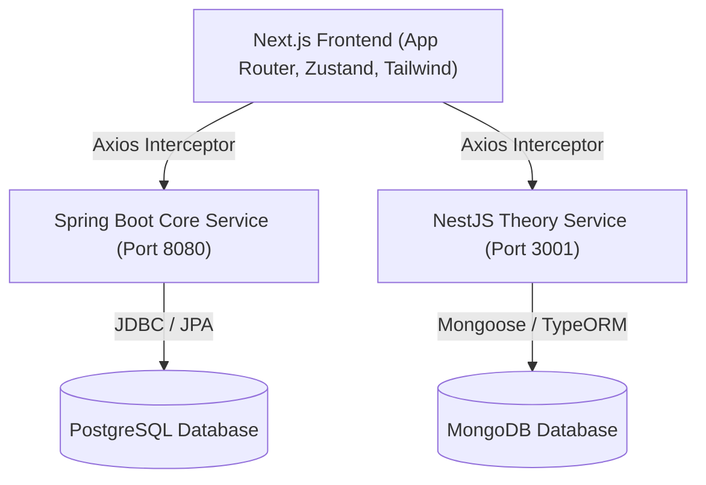

# 🗺️ Tổng quan Kiến trúc Hệ thống (System Architecture)

Dự án **LangWhich** là một nền tảng học tiếng Anh toàn diện (ôn tập từ vựng SRS, làm bài test, học lý thuyết TOEIC). Hệ thống được xây dựng theo mô hình **Multi-service Backend** kết hợp với **Next.js Frontend (App Router)**.

---

## 1. Sơ đồ Kiến trúc Tổng thể (System Architecture Overview)

Hệ thống được chia thành 3 phần chính hoạt động độc lập và giao tiếp qua REST APIs:

### Chi tiết các dịch vụ:
| Dịch vụ | Công nghệ chính | Nhiệm vụ | Database |
| :--- | :--- | :--- | :--- |
| **Frontend** | Next.js 16 (App Router), TypeScript, TailwindCSS, Zustand | Hiển thị giao diện, quản lý client state, xử lý logic tương tác (Flashcard, Quiz, Điền từ). | `localStorage` / Browser Cookies |
| **Spring Boot Core** | Java, Spring Boot 3, Spring Security, JWT, JPA | Quản lý User Auth, Bài học từ vựng (Vocab), Thư mục (Folder), Tiến trình học (History) & Thuật toán SRS (SM-2). | PostgreSQL |
| **NestJS Theory** | TypeScript, NestJS, Mongoose | Quản lý module TOEIC Theory (Lý thuyết), Topic lý thuyết, bài học lý thuyết, và tích hợp Rich Text Editor (Tiptap). | MongoDB |

---

## 2. Giao tiếp Client - Server (Next.js ↔ Backends)

Tất cả các API call từ Frontend được điều phối qua một Axios client thống nhất tại `frontend/src/lib/api-client.ts` để đảm bảo:
1. **Tự động đính kèm Token**: Thêm `Authorization: Bearer <access_token>` vào header của mọi request gửi đi.
2. **Cơ chế Token Rotation (Access / Refresh Token)**:
   * Khi Access Token hết hạn (Server trả về `401 Unauthorized`), Axios Interceptor sẽ tự động tạm dừng request hiện tại.
   * Gửi một request ẩn đến `POST /auth/refresh-token` bằng `refresh_token` để lấy `access_token` mới.
   * Lưu token mới vào `localStorage`, cập nhật header và tiếp tục gửi lại request cũ (Retry).
   * Nếu `refresh_token` cũng hết hạn hoặc lỗi, hệ thống xóa trắng token và redirect người dùng về trang `/auth/login`.

```mermaid
sequenceDiagram
    autonumber
    actor User as Client App
    participant Interceptor as Axios Interceptor
    participant Server as Backend API

    User->>Interceptor: Gọi API endpoint (e.g. GET /api/v1/srs/due)
    Note over Interceptor: Tự động đính kèm JWT Access Token
    Interceptor->>Server: Gửi Request kèm Header Authorization
    Server-->>Interceptor: Trả về 401 Unauthorized (Token expired)
    
    rect rgb(30, 41, 59)
        Note over Interceptor: Kích hoạt chế độ Retry & Refresh
        Interceptor->>Server: POST /auth/refresh-token (kèm Refresh Token)
        alt Token hợp lệ
            Server-->>Interceptor: Trả về Access Token mới
            Note over Interceptor: Lưu Access Token mới vào LocalStorage
            Interceptor->>Server: Gửi lại Request ban đầu với Token mới
            Server-->>User: Trả về dữ liệu thành công (200 OK)
        else Refresh Token hết hạn
            Server-->>Interceptor: Trả về 401/403
            Note over Interceptor: Xóa Access/Refresh Token
            Interceptor-->>User: Redirect sang trang đăng nhập (/auth/login)
        end
    end
```

---

## 3. Cấu trúc Thư mục Tài liệu Kiến trúc

Tài liệu chi tiết về logic triển khai, luồng dữ liệu, quản lý state và tích hợp API cho từng chức năng cụ thể được phân chia như sau:

* [system-architecture/](#) (Thư mục gốc)
  * `overview.md` — Tài liệu tổng quan (File này)
  * **`frontend/`** (Kiến trúc Client-side State & Logic)
    * [auth.md](file:///f:/Project/english-application/langwhich-website-project/system-architecture/frontend/auth.md) — Quản lý State Xác thực & Bảo mật (Zustand + Interceptor).
    * [vocab.md](file:///f:/Project/english-application/langwhich-website-project/system-architecture/frontend/vocab.md) — Kiến trúc màn hình Học Từ Vựng (Flashcard, Review, Test, SRS).
    * [theory.md](file:///f:/Project/english-application/langwhich-website-project/system-architecture/frontend/theory.md) — Logic hiển thị Lý thuyết & Tiptap Editor.
  * **`backend/`** (Kiến trúc Server-side & Business Logic)
    * [spring_boot_vocab.md](file:///f:/Project/english-application/langwhich-website-project/system-architecture/backend/spring_boot_vocab.md) — Cơ chế Spaced Repetition (SRS SM-2), SQL Schema & Core APIs.
    * [nestjs_theory.md](file:///f:/Project/english-application/langwhich-website-project/system-architecture/backend/nestjs_theory.md) — Thiết kế NestJS Theory Module & MongoDB Models.
