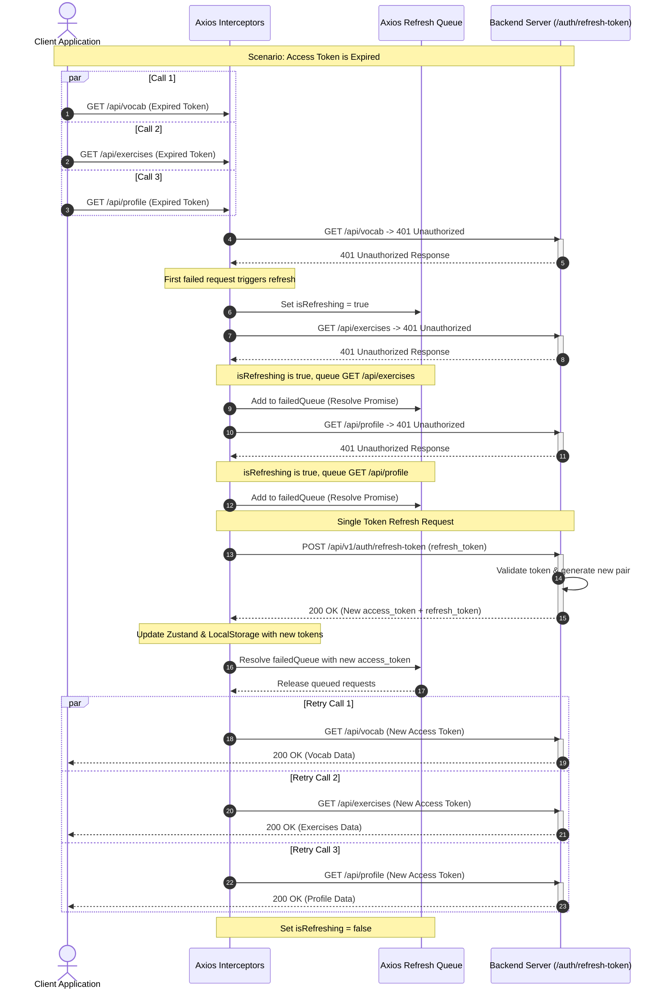

# Refresh Token System Architecture

This document details the architectural design, implementation flow, state management, and integration details of the **Refresh Token System** within the LangWhich application.

---

## 1. Logic of Implementation (Logic Triển Khai)

The JWT Refresh Token system ensures that the user session remains seamless and secure. Instead of forcing users to log in again when their short-lived `access_token` (e.g., valid for 15 minutes) expires, the system uses a long-lived `refresh_token` (e.g., valid for 7 days) to silently acquire a new `access_token` in the background.

To prevent race conditions where multiple concurrent API requests fail with a `401 Unauthorized` status simultaneously and trigger duplicate refresh requests, we implement a **thread-safe Promise Queue** inside the Axios interceptors.

### Step-by-Step Flow:
1. **Request Interception**: The client attaches the current `access_token` as a Bearer token in the `Authorization` header of all outgoing requests.
2. **Token Expiration (401)**: When an API request fails with `401 Unauthorized`, the response interceptor catches the error.
3. **Queueing Concurrent Requests**:
   * If a refresh token request is **already in progress** (`isRefreshing === true`):
     * The failing request's configuration is suspended and pushed into a `failedQueue` (wrapped in a Promise).
     * It waits for the refresh operation to resolve.
   * If no refresh is in progress (`isRefreshing === false`):
     * `isRefreshing` is set to `true`.
     * The client extracts the `refresh_token` from local storage.
     * It sends a single, direct POST request to `/api/v1/auth/refresh-token` using raw Axios (to avoid hitting interceptors recursively).
4. **Token Generation (Backend)**:
   * The backend validates the `refresh_token` signature and expiration date.
   * Upon successful verification, the backend rotates the tokens by generating a new short-lived `access_token` **and** a new long-lived `refresh_token` (Token Rotation pattern for extra security).
   * It returns both tokens in the `AuthResponse` DTO.
5. **Success Resolution**:
   * The frontend updates both local storage and the Zustand `useAuthStore` with the new tokens using the `updateTokens` action.
   * The `failedQueue` is resolved, retrying all suspended requests with the newly minted `access_token`.
   * The initial request that triggered the refresh is also retried and returned.
   * `isRefreshing` is set back to `false`.
6. **Failure Recovery**:
   * If the refresh token is expired or invalid, the refresh request fails.
   * All queued requests in `failedQueue` are rejected.
   * The frontend calls `clearAuth()` to purge the Zustand store and `localStorage`.
   * The user is gracefully redirected to the `/auth/login` page.

---

## 2. State Management (Quản Lý Trạng Thái)

### 2.1. Client-Side State (Zustand: `useAuthStore`)
The client uses Zustand to manage authentication state across the application. The token strings are kept inside the store for runtime requests and mirrored in `localStorage` for cross-tab persistence.

#### Properties:
* `user: User | null`: The currently logged-in user profile info.
* `accessToken: string | null`: The raw JWT token for authorization.
* `refreshToken: string | null`: The raw JWT token for token rotation.
* `isAuthenticated: boolean`: A fast-access flag for guard routes.
* `_hasHydrated: boolean`: An internal flag indicating if the persisted state has been hydrated from localStorage to prevent race conditions during page load/refresh.

#### Actions:
* `setAuth(user, accessToken, refreshToken)`: Sets all user and token states and saves them in local storage.
* `clearAuth()`: Purges user data, clears tokens from memory and local storage, logging the user out.
* `updateTokens(accessToken, refreshToken?)`: Updates the access token (and optionally the rotated refresh token) in the store and local storage.
* `setHasHydrated(state)`: Updates the hydration status once Zustand's `onRehydrateStorage` fires.

### 2.2. Server-Side Flow
The server-side flow follows a clean Spring Boot controller-service-repository pattern:

```txt
[Client Request]
       │
       ▼
[AuthController] ── (Validates RefreshTokenRequest DTO)
       │
       ▼
[AuthService] ───── (Extracts username from token, loads UserDetails)
       │
       ▼
[JwtService] ────── (Validates signature and expiration)
       │
       ▼
[UserRepository] ── (Verifies user still exists and is active)
       │
       ▼
[AuthResponse] ──── (Generates and returns new token pair)
```

---

## 3. Frontend-Backend Integration (Tích hợp FE-BE)

### 3.1. Integration Details
| Category | Detail |
| --- | --- |
| **HTTP Method** | `POST` |
| **Path** | `/api/v1/auth/refresh-token` |
| **Headers** | `Content-Type: application/json` |
| **Authentication** | None (Public Endpoint) |

### 3.2. Payload Models

#### Request DTO (`RefreshTokenRequest`):
```typescript
interface RefreshTokenRequest {
  refreshToken: string; // The active refresh token stored in local storage
}
```

#### Response DTO (`AuthResponse`):
```typescript
interface AuthResponse {
  access_token: string;
  refresh_token: string;
  token_type: "Bearer";
  expires_in: number; // Expiration duration in seconds
  user: {
    id: number;
    username: string;
    email: string;
    role: "USER" | "ADMIN";
  };
}
```

---

## 4. Sequence Diagram

The diagram below visualizes the concurrent queueing flow when multiple API calls (`GET /api/vocab`, `GET /api/exercises`, `GET /api/profile`) fire concurrently when the JWT token has expired.


